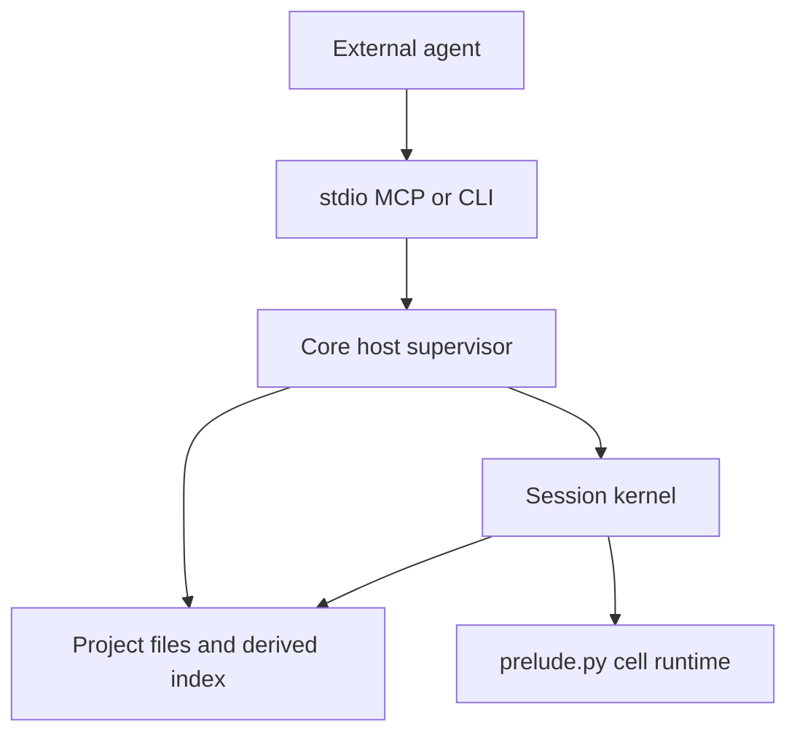

# Implementation guide

This guide maps the Quail specification onto code. It defines ownership,
dependency direction, build order, and the seams that must remain stable
while the implementation is built.

It is not a fourth specification:

- `docs/api.md` owns agent-visible behavior.
- `docs/storage.md` owns durable files, the derived index, replay, and
  expression-to-SQL semantics.
- `docs/kernel.md` owns process behavior, limits, tools, CLI, and Hosted
  seams.

When this guide appears to disagree with one of those documents, the
document wins. When the documents disagree with each other, do not hide a
choice in code or here; resolve the owning specification before implementing
that slice.

There is one intentional pending specification change in section 6: semantic
indexing embeds each complete field value once. It does not split values into
passages. The canonical documents still use passage/chunk language and must
be aligned before the semantic slice is implemented.

The implementation should be small because the boundaries are strong, not
because behavior is duplicated or deferred.

## 1. Shape

Quail has two processes and one durable project:



The host supervisor may read project files and contact the configured
embedding provider. During privileged bootstrap the kernel opens its index
and run log; it then loses filesystem and network access. Hosted replaces
host policy and process placement; it does not replace Core storage,
language, or query semantics.

Four rules organize the implementation:

1. **Text is truth.** The manifest, CSVs, and session logs are durable.
   SQLite, FTS state, value mappings, and vectors are rebuildable.
2. **The kernel owns semantics.** Expressions, predicates, verbs, SQL
   compilation, and notebook-cell behavior exist only in `prelude.py`.
3. **The host owns capabilities.** Paths, locks, spawning, embedding HTTP,
   and external adapters stay outside the kernel.
4. **Adapters contain no product logic.** MCP and CLI translate arguments
   into the same host service and translate its result back.

Core is an environment, not an agent harness. It does not call a model,
spawn subagents, expose shell/file tools inside cells, or run Git.

## 2. Source layout and dependency direction

Keep `quail/__init__.py` side-effect free. Python imports it before
`python -m quail.prelude`; eager host-side re-exports there would pull the
host dependency graph into kernel startup.

| Module | Owns | May depend on | Must not contain |
| --- | --- | --- | --- |
| `project.py` | Manifest, paths, session metadata, log parsing, replay map, locks | Standard library | SQLite, HTTP, MCP, expression logic |
| `index.py` | CSV import/rebuild, SQLite schema, FTS build, warm-pack ingestion | `project.py`, SQLite | Provider HTTP, kernel lifecycle, MCP |
| `embed.py` | Provider configuration, batching, retries, embedding request | `project.py`, HTTP client | Text segmentation, SQLite writes, MCP |
| `prelude.py` | Kernel bootstrap, language, compiler, verbs, replay application, cell loop, confinement | Standard library, RE2, optional NumPy | Any `quail.*` import, HTTP, MCP, CSV import |
| `kernel.py` | Session subprocess, control protocol, timers, restart, embedding forwarding | `project.py`, `embed.py` | SQL or language implementation |
| `tools.py` | Reusable host service and warm orchestration | `project.py`, `index.py`, `embed.py`, `kernel.py` | MCP types, argparse, expression internals |
| `mcp.py` | Stdio MCP adapter | `tools.py`, MCP SDK | A second copy of tool behavior |
| `cli.py` | Command parsing and presentation | Host modules | In-process evaluation of agent code |

`prelude.py` is deliberately self-contained. Organize it into ordinary
private classes and functions, but do not split runtime behavior into modules
that the confined process must import. Log replay ordering is duplicated
between host and prelude; check both implementations against the same fixtures
so they cannot drift.

## 3. Build in vertical slices

Each step should leave a tested, coherent capability. Do not create empty
facades for later steps and do not implement a temporary second engine.

| Step | Deliverable | Proof |
| --- | --- | --- |
| 1 | Packaging, inert `__init__.py`, project manifest and errors | A project loads and invalid input fails clearly |
| 2 | Sessions, log parser, replay map, fork, and locks | Logs deterministically recover final tag values |
| 3 | CSV import and complete disposable SQLite index | Deleting the index and reopening reproduces it |
| 4 | Prelude language, compiler, and verbs without semantic search | API examples execute against the real index |
| 5 | Cell loop, tag transaction, logging, and confinement | A successful or failed cell has exactly the documented effects |
| 6 | Host kernel lifecycle and embedding control path | A process can run, time out, restart, and request embeddings |
| 7 | Semantic search and local warming | First use embeds; later use reuses vectors |
| 8 | Shareable warm shards | Independent workers produce mergeable vector packs |
| 9 | Host service, stdio MCP, and CLI | Every surface exercises the same implementation |

Lexical search belongs in the index/compiler slices: FTS is built during CSV
import. Semantic search belongs after the host/kernel embedding channel
exists.

## 4. Cross-cutting flows

### Opening a dataset

There is one host entry path for opening work:

1. Load and validate the project.
2. Ensure the dataset index exists and matches the CSV hash.
3. Rebuild the index when required.
4. Ingest compatible shareable warm packs into the derived vector table.
5. Acquire the session lock.
6. Spawn or reuse the session kernel.
7. Let the kernel compare the session log digest with `applied` and replay
   when needed.

`setup`, `exec`, CLI commands that need the index, and Hosted must use
this path rather than reproducing pieces of it.

Build a replacement index in a temporary path and publish it only after the
build succeeds. Re-import reapplies every session's replay map and records
the corresponding digest, so the next kernel open does not redo the same
work. The index builder never calls the embedding provider.

### Replay

`project.py` owns the pure operation:

```text
session log files → ordered successful writes → final (entry, field) values
```

`index.py` uses it after a CSV rebuild. `prelude.py` implements the same
specified ordering when an existing index is behind a pulled log. Both use
the same fixture corpus and expected replay result.

Malformed-line handling, ordering, deletion by `null`, and orphan counting
come directly from `docs/storage.md`. Entry IDs—not SQLite rowids—cross the
durable boundary.

Use one deterministic digest algorithm in both processes: sort log files by
their project-relative POSIX path and hash each path plus its exact bytes.
The digest is a cache marker, not user-visible history.

### A cell

Implement the sequence in `docs/kernel.md` literally:

1. Parse and validate the cell.
2. Begin the tag transaction.
3. Arm limits and capture output.
4. Execute statements and display the final expression.
5. On success, append and sync the successful log record, then commit the
   derived tag state and advance its applied digest.
6. On failure, roll back tag state, keep ordinary Python assignments, append
   the failed-cell record, and return the cleaned traceback.
7. Restore process state and return one bounded result.

The log is durable truth. SQLite must never contain a committed tag write
that cannot be recovered from the log. Any optimization of this sequence
must preserve that invariant.

Tag changes made earlier in a cell are visible to later lines in that cell,
including a newly created tag field. Rollback restores both values and the
field catalog.

### Errors

Keep the boundary simple:

- A cell syntax/runtime/Quail error is an `exec` result. Iterating on cells
  is normal.
- A project, session-lock, spawn, or protocol failure is a host
  `QuailError`.
- Both serialize as `{type, message, hint}`.
- MCP and CLI format the same host result; neither interprets cell code.

### Confinement

The kernel opens everything it needs before installing the audit hook and
network isolation. The host passes only project/session identifiers, limits,
and the control channel; the prelude opens the index and run log during
bootstrap. Provider credentials remain in the host.

Confinement in Core prevents ordinary accidental access; it is not a
multi-tenant security boundary. Hosted supplies the container or microVM.
Do not add a Python-syntax allow-list.

### Concurrency

- One live kernel owns one session lock.
- Calls into one kernel are serialized.
- Different sessions use separate connections to the same WAL database.
- SQLite still has one writer; busy failures must become a clear, bounded
  host or cell error rather than an unhandled SQLite exception.
- Derived cache work may be repeated, but it must be idempotent.

## 5. Module contracts

### `quail/project.py`

Expose one `Project(path)` seam and small value objects for validated
dataset/session configuration.

It must:

- Resolve all project paths from the manifest root.
- Validate the manifest and provider secret references.
- Validate dataset and session names before using them as path segments.
- Read and write `session.toml`.
- Create/fork sessions without invoking Git.
- Parse run headers and cell records.
- Produce session summaries for setup/CLI.
- Produce the pure replay map and log digest.
- Acquire/release advisory session locks.

It must not open SQLite or append cell records. Only the kernel that owns a
run file appends to that file.

### `quail/index.py`

Expose an idempotent `ensure_index(project, dataset)` operation. It owns the
schema in `docs/storage.md`, imports source cells as text, builds FTS, and
rebuilds when the source hash changes.

Important implementation rules:

- Quote identifiers; bind values.
- Enable WAL and set the busy timeout on every connection.
- Build FTS for source fields except the canonical ID.
- Keep tag values as JSON text and vectors as little-endian float32.
- On rebuild, preserve compatible content-addressed vectors, reconstruct
  source-value mappings, replay every session, and report orphan IDs.
- Ingest compatible warm packs before a kernel is spawned.
- Enumerate deterministic source-value work and read/write warm packs for
  the host warming path.
- Treat the entire file as disposable; schema-version mismatch rebuilds it
  rather than migrating user truth.

CSV validation should fail at import with the source row/header in the
message. Do not allow a malformed input to become a later SQL error.

### `quail/embed.py`

Expose one batch operation:

```python
embed(project, dataset, texts) -> list[list[float]]
```

It resolves the configured provider, reads the referenced credential at call
time, batches requests, retries only transient failures, and preserves input
order. It validates that all values are finite and every returned vector has
the same nonzero dimension, then returns that dimension to the kernel.

It does not segment text, hash values, write SQLite, or know about fields.
Those are kernel/index concerns. Hosted may replace this call with its own
provider callback.

### `quail/prelude.py`

This file is the kernel executable. Keep its internal sections in execution
order:

1. Wire/error/value types.
2. Expression and predicate nodes.
3. Pipeline produce checking.
4. SQL compiler and registered SQLite functions.
5. Entry and verbs.
6. Lexical and semantic preparation/scoring.
7. Replay application.
8. Cell execution.
9. Bootstrap and confinement.
10. Control loop.

Implement the method table and verb signatures from `docs/api.md`; implement
SQL shapes and registered functions from `docs/storage.md`. Do not duplicate
those tables in comments or invent parallel Python evaluation semantics.

The user namespace contains exactly the documented public names and the
documented pre-imported modules. The same names are available on the
`quail` recovery object. A generated contract test compares the namespace
with code references in `docs/api.md`.

The database connection, log handle, compiler context, and control channel
are runtime internals. Core accepts that determined introspection can reach
them; do not distort the design trying to make in-process Python a security
boundary.

### `quail/kernel.py`

`Kernel(project, session, spawn=...)` owns:

- The session lock and subprocess lifetime.
- Startup arguments and ready handshake.
- One-at-a-time cell execution.
- Wall timeout, interruption, kill, and restart reporting.
- The host side of embedding requests.
- Clean shutdown and reset.

The local spawn starts `python -m quail.prelude`. Hosted may substitute a
container/microVM spawn that speaks the same protocol. `kernel.py` never
imports prelude as a library.

The host process needs one service instance that owns its active
`session -> Kernel` map. Do not hide live kernels in module globals.

### `quail/tools.py`

Provide the four agent-facing operations described in `docs/kernel.md`:

- `setup`
- `exec`
- `export`
- `reset`

They share one process-local service instance and the dataset-open path from
section 4. This is the reusable boundary for MCP, CLI, and Hosted.

`exec` is the only operation that evaluates a cell. It creates/forks a
session when required, reuses its kernel, and returns cell failures without
turning them into tool failures. `reset` drops only the live Python
process; committed tags remain.

The same service has a CLI/host operation for `warm`. It asks `index.py`
for source values, calls `embed.py` in batches, and gives the vectors
back to `index.py` for validation, cache insertion, and optional pack
writing. It does not start a session, execute a synthetic cell, or write a
session log. The remaining CLI-only project operations delegate through this
service to `project.py` or `index.py`; they do not create a second host API.

### `quail/mcp.py`

Register the four stdio tools and delegate immediately to the host service.
No authentication, SQL, session rules, or error reinterpretation belongs
here.

Package `docs/api.md` as data and return that exact text from setup; never
resolve it relative to the caller's working directory.

### `quail/cli.py`

Implement the command list in `docs/kernel.md`. Commands shared with MCP call
the same service methods; CLI-only project commands delegate to the same host
modules through that service.

`quail exec` creates a transient service/kernel, runs one cell, prints the
result, and closes it. Tags persist through the log; Python variables do not
persist between separate CLI invocations.

`quail warm` calls the host service's warm operation. It does not evaluate
agent code.

## 6. Warming

### What warming means

Warming is **semantic preparation only**.

Lexical search is already prepared when `index.py` imports the CSV and
builds FTS; lexical rows for tag fields are maintained when tags are
written. There is no provider call and no useful separate lexical warm step.

Semantic search requires more work:

1. Read each non-empty value from the selected source field or fields.
2. Hash and deduplicate complete values.
3. Embed values missing from the vector cache.
4. Record which value hash belongs to each entry and field.

One table cell—one field on one entry—is the atomic semantic unit. A value
is never split into passages, inspected against a model-specific limit, or
silently truncated. Quail sends the complete value to the configured
provider. Any provider rejection is an ordinary embedding error; unsuitable
value lengths are a dataset concern.

A semantic query is embedded whole as well. Its score for an entry is the
cosine similarity to that entry's one field-value vector; there is no
passage-level maximum or other aggregation.

Without an explicit warm, the first `.semantic()` performs that work.
`quail warm DATASET [--field FIELD]` performs it ahead of time. Warming is
an optimization only; warm and cold queries must return identical scores.
It prepares corpus vectors, not future query strings.

Lazy warming belongs to `prelude.py`: a semantic query discovers a missing
vector and asks the host to embed it. Explicit CLI warming is a host batch
path: `tools.py` coordinates value inventory and cache writes in
`index.py` with provider calls in `embed.py`. It does not spawn a kernel.
Both paths use the same whole-value hashing and vector representation.

### Shareable warm shards

Add one optional argument:

```text
quail warm DATASET [--field FIELD] [--shard I/N]
```

Without `--shard`, warm all selected source values into the local
gitignored SQLite cache, as already described by the specification.

With `--shard I/N`:

- `I` is one-based and `1 <= I <= N`.
- Build the distinct non-empty value set for the selected source field, or all
  non-ID source fields when `--field` is omitted.
- Assign a value to shard `I` when its text SHA-256 integer modulo `N`
  equals `I - 1`.
- Embed only that shard.
- Insert the vectors into the local cache.
- Write a shareable warm pack under `warm/`.
- Report selected, reused, and newly embedded value counts plus the pack
  path.

Hash partitioning makes assignment deterministic without a coordinator.
Workers only need the same source contents, embedding configuration, field
selection, and shard count.

Use this layout:

```text
warm/
  <dataset>/
    <source-hash>/
      <plan-hash>/
        part-0001-of-0008.jsonl
```

`plan-hash` is the SHA-256 of canonical JSON containing the warm-pack format
version, embedding model string, sorted field names, and shard count. It
prevents incompatible warm runs from choosing the same part filenames; it is
not a separate manifest.
The file begins with one header record:

```json
{"quail_warm":1,"dataset":"notes","source_hash":"…","embed":"ollama/embeddinggemma:latest","fields":["body"],"dims":768,"shard":[1,8]}
```

Each remaining line is sorted by text hash and contains one vector:

```json
{"text_hash":"sha256:…","vector":"<base64 little-endian float32>"}
```

The source text and entry rowids are not included. The CSV reconstructs
value-to-entry mappings cheaply and deterministically; only the expensive
vectors need to travel. Repeated identical values share the same vector.

Warm packs are derived, shareable cache—not analysis truth. Quail writes the
pack atomically and prints its path; it never commits or pushes it. Separate
workers write separate part files, so ordinary Git merges take their union
without line-level conflicts. Choose enough shards to keep each file
comfortably below the Git host's file-size limit.

If a shard contains no values, report that fact and do not write a pack.
Warm packs are caches, not completion records.

On dataset open, `index.py` scans packs for the current dataset and source
hash. It validates the format, model, and vector dimension, then inserts by
`(model, text_hash)` with `INSERT OR IGNORE`. Fields and shard count describe
how a pack was produced; they do not change whether one of its
content-addressed vectors is reusable. Missing parts are fine: the next
semantic warm/query embeds only the hashes still absent.

Keep the first version deliberately narrow:

- Source fields only. Session-specific tag fields continue to warm lazily
  inside their session.
- One vector format and whole-value embedding only.
- No coordinator, manifest of workers, remote cache service, Git API, or
  completeness database.
- No automatic repartitioning. Start another plan with a different `N` if
  needed.
- An already-running kernel sees newly pulled packs after reset/reopen; do
  not add live cache invalidation.

Example with four workers:

```sh
quail warm notes --field body --shard 1/4
quail warm notes --field body --shard 2/4
quail warm notes --field body --shard 3/4
quail warm notes --field body --shard 4/4
```

Each worker commits its one file. After the branches are merged and pulled,
the next dataset open imports all four packs into the local SQLite cache.

## 7. Verification

Tests should prove boundaries and durable behavior, not mirror module
internals.

### Contract tests

- Every public prelude name appears in `docs/api.md`, and every documented
  name exists.
- Every expression method accepts and produces exactly the documented
  pipeline type.
- MCP and CLI are thin adapters over the same host service.
- `quail/__init__.py` does not import the host graph during prelude startup.

### Durable-state tests

- Deleting SQLite and reopening reconstructs source rows and session tags.
- Host replay and prelude replay produce the same result from shared fixtures.
- A failed cell never leaves a durable tag write.
- Crash points around log sync and SQLite commit recover from the log.
- Re-import preserves compatible vectors, reapplies tags, and reports
  orphaned IDs.
- Fork copies history without sharing mutable files.

### Engine tests

- Compiler cases cover every row in the expression/predicate tables.
- SQL three-valued logic is reduced to the documented two-valued predicates.
- Lexical tests distinguish absent, no-match, and positive score.
- Warm and cold semantic queries return the same result.
- Each non-empty field value maps to exactly one semantic vector, and long
  values are passed through whole without special handling.
- Limits roll back tags and report whether the kernel restarted.

### Warm-shard tests

- Shards are disjoint and their union equals the full distinct value set.
- Assignment is independent of CSV row order and worker.
- Pack records are sorted by text hash.
- Partial pack sets import successfully and missing hashes embed lazily.
- Merging pack directories requires no content merge.
- Wrong source/model/dimensions/version is rejected.
- Duplicate vector keys are ignored.

Keep performance checks coarse and representative: project open, count,
retrieve, lexical search, warm semantic search, and bulk tag commit on a
fixed corpus. Do not bake machine-specific millisecond promises into the
product specification.

## 8. Specification gates

The current canonical documents contain a few choices that cannot be
implemented simultaneously. Resolve each in its owning document when that
slice begins; do not let the guide silently become authoritative:

1. **Late imports and the audit hook.** `api.md` permits ordinary standard
   library imports, while `kernel.md` denies every later `open` event.
   Importing a module that is not already loaded normally opens its source.
2. **Search after transformation.** The API method table permits
   `.slice(...).lexical(...)` and similar pipelines, while the storage
   compiler defines search through a persisted field index. Choose a single
   semantic path before implementing search.
3. **Method return wording.** `api.md` says every pipeline method returns
   an `Expression`, while its table says `.isin` and `.contains` return
   a predicate. The table and verb examples require `Predicate`.
4. **Embedding dimensions.** The kernel learns dimensions on first embed,
   but the documented SQLite authorizer does not grant the required
   `meta.embed_dims` update.
5. **Applied digest after failed cells.** Failed cells change the log digest
   without changing tags. Decide whether their append advances `applied` or
   intentionally causes a replay on next open.
6. **Operations on `any`.** Tags may contain dictionaries and mixed JSON
   values, while several `q_*` descriptions define only scalar/array
   behavior. Specify the per-value result for text, regex, length, slicing,
   containment, grouping, and search.
7. **Seeded random after re-import.** Storage keys `Random(seed)` by SQLite
   rowid, which can change when a CSV is rebuilt. Decide whether a seeded
   sample is stable only for one index build or across builds by entry ID.
8. **Rebuild with live kernels.** Automatic CSV re-import can replace the
   index while kernels still hold connections to it. Choose fail/wait/restart
   behavior before implementing automatic rebuild.
9. **Who may contact the embedding provider.** The manifest and kernel
   require host-side embedding HTTP, while the broad statement “Core never
   contacts a remote” appears elsewhere. Distinguish the networkless kernel
   from the Core host supervisor.
10. **Whole-value semantic indexing.** `api.md` and `storage.md` still
    describe passages and best-passage scoring. The approved direction is
    one complete field value, one vector, and one similarity score. Align
    both documents before implementing semantic search.

Everything else should be implemented directly from the three specification
documents. Avoid adding extension points, registries, alternate backends, or
abstraction layers until a second real implementation needs them.

## 9. File-by-file construction blueprint

This is the executable form of the build order in section 3. It fixes the
repository shape, the order in which files become real, and the responsibility
of each file. It does not restate the language or storage specification.

Create a file only when its slice is being implemented. Do not add placeholder
modules, empty tests, compatibility layers, or interfaces for hypothetical
backends.

### Final checked-in layout

```text
.
├── .github/
│   └── workflows/
│       └── ci.yml
├── docs/
│   ├── api.md
│   ├── kernel.md
│   └── storage.md
├── quail/
│   ├── __init__.py
│   ├── project.py
│   ├── index.py
│   ├── embed.py
│   ├── prelude.py
│   ├── kernel.py
│   ├── tools.py
│   ├── mcp.py
│   └── cli.py
├── tests/
│   ├── conftest.py
│   ├── test_project.py
│   ├── test_index.py
│   ├── test_language.py
│   ├── test_cell.py
│   ├── test_embed.py
│   ├── test_kernel.py
│   ├── test_semantic.py
│   ├── test_warm.py
│   ├── test_tools.py
│   └── test_surfaces.py
├── .gitignore
├── AGENTS.md
├── IMPLEMENTATION_GUIDE.md
├── LICENSE
├── README.md
├── pyproject.toml
└── uv.lock
```

There is no `src/` directory, `quail/__main__.py`, migrations directory,
provider package, protocol package, ORM layer, or checked-in copy of
`docs/api.md`. Hatch includes that canonical file as `quail/data/api.md` in
the built wheel; the copy is a build artifact, not another source file.

### Creation order

Each row is one coherent change and must pass before the next begins. Files
listed as “extend” already exist and gain only the behavior for that slice.

| Order | Create or extend | Slice is complete when |
| --- | --- | --- |
| 1 | `pyproject.toml`, `uv.lock`, `.github/workflows/ci.yml`, `quail/__init__.py`, `tests/conftest.py`, `quail/project.py`, `tests/test_project.py` | A project can be initialized, loaded, validated, locked, forked, and replayed without SQLite, and the slice passes in CI. |
| 2 | `quail/index.py`, `tests/test_index.py` | A valid CSV builds the complete disposable index, and deleting it then reopening produces the same source and tag state. |
| 3 | `quail/prelude.py`, `tests/test_language.py` | Expressions, predicates, compilation, lexical search, and read-only verbs execute against the real index. |
| 4 | Extend `prelude.py`; create `tests/test_cell.py` | Notebook display, persistent variables, transactional tags, logs, errors, and limits satisfy the cell contract. |
| 5 | `quail/embed.py`, `tests/test_embed.py`, `quail/kernel.py`, `tests/test_kernel.py` | A host can run and restart one confined kernel and service an embedding request over the control channel. |
| 6 | Extend `prelude.py` and `index.py`; create `tests/test_semantic.py` | Whole-value semantic search is identical cold and warm and never splits a value. |
| 7 | `quail/tools.py`, `tests/test_tools.py`; extend `index.py` with local and shareable warming; create `tests/test_warm.py` | One host service owns its kernels, all host operations use it, and independently produced shard files combine by directory union. |
| 8 | `quail/mcp.py`, `quail/cli.py`, `tests/test_surfaces.py`; finish the console entry point in `pyproject.toml` | MCP and CLI are thin, tested adapters over the same service. |
| 9 | Update only the status and usage portions of `README.md`; add the installed-wheel smoke test to `ci.yml` | A clean clone installs, checks, tests, builds a wheel, and runs the installed `quail` command. |

Resolve only the specification gates needed by the current row. In
particular, do not begin row 6 until the whole-value semantic wording has
replaced passage wording in both canonical documents.

### Root and support files

#### `pyproject.toml`

Use PEP 621 with Hatchling and a single package, `quail`. It contains:

- Python 3.12 or newer and the Apache-2.0 project metadata.
- Direct runtime dependencies only: `google-re2` and `mcp`.
- NumPy as an optional performance dependency; the standard-library scoring
  path remains functional.
- A development group containing `pytest`, `ruff`, and `mypy`.
- `quail = "quail.cli:main"` as the sole console script.
- Pytest, Ruff, and mypy configuration kept to the few project-wide settings
  actually used.
- A Hatch wheel `force-include` from `docs/api.md` to
  `quail/data/api.md`, so the canonical agent document ships without a
  checked-in mirror.

Do not put project manifest defaults, provider URLs, or kernel limits here.
Do not add a plugin system or optional database/backend groups.

#### `uv.lock`

Generate it from `pyproject.toml` and commit it. Never edit it by hand.
Regenerate it whenever declared dependencies change.

#### `.gitignore`

Ignore Python/build caches, `.venv/`, `.quail/`, and
`sessions/*/.lock`. Do not ignore `data/`, `sessions/`, `exports/`, or
`warm/`; those are durable or intentionally shareable project files.

#### `README.md`, `AGENTS.md`, `docs/`, and `LICENSE`

Keep their current ownership:

- `README.md` explains the product and the shortest successful local path.
- `AGENTS.md` contains repository rules, not implementation detail.
- The three files under `docs/` remain the specification owners described at
  the top of this guide.
- `LICENSE` remains unchanged.

Do not duplicate sections from this guide into those files. Update a
canonical document only when behavior changes, and update README examples
only after the corresponding command works.

#### `.github/workflows/ci.yml`

Use one small Linux job on Python 3.12. From the first slice it installs from
`uv.lock`, runs Ruff, mypy, and pytest, and builds the wheel. Once the CLI
exists, it also installs that wheel into a clean environment and smoke-tests
`quail --help`. Add no version matrix, release workflow, service containers,
or coverage gate until there is a concrete need.

### Package files

#### `quail/__init__.py`

Keep this file inert: one package docstring and an empty `__all__`. It must
not import any other Quail module. This guarantees that
`python -m quail.prelude` does not load host code before confinement.

Host callers import the explicit seams from their owning modules:
`Project`, `Kernel`, and `QuailService`. Do not re-export the agent language;
it exists only inside the kernel.

#### `quail/project.py`

Build the file from top to bottom in this order:

1. Constants and the host `QuailError` exception (`type`, `message`, `hint`).
2. Small immutable records for validated dataset, session, and kernel
   configuration.
3. Name, path, timestamp, TOML, and atomic-text-write helpers.
4. `Project(path)`: manifest discovery, strict parsing, and resolved paths.
5. Project initialization and manifest updates used by `quail init` and
   `quail import`.
6. Session create, list, fork, and metadata operations.
7. Run-log parsing, digesting, and replay-map construction.
8. The advisory session-lock context manager.

Only `Project` and `QuailError` are promised external host seams.
Configuration records are Core-internal even when another Core module imports
them. This file performs no SQL, HTTP, cell evaluation, or Git operation, and
it never appends a run log.

#### `quail/index.py`

Build the file in this order:

1. Schema/version constants and the literal schema SQL.
2. SQLite connection setup: foreign keys, WAL, busy timeout, and row factory.
3. CSV header/row/ID validation, source hashing, and identifier quoting.
4. Full index construction at a temporary path and atomic publication.
5. Session replay into a rebuilt index, applied digests, and orphan counts.
6. `ensure_index(project, dataset)` and small read helpers needed by setup,
   fields, and export. SQL does not leak into `tools.py`.
7. Whole-value hashing and source-cell-to-vector mapping used by semantic
   search and warming.
8. Warm-value inventory, vector-cache writes, and warm-pack read, write,
   validation, ingestion, and shard selection from section 6.

Use functions and small records, not an ORM or repository class. Keep schema
creation in this file rather than creating migrations for a disposable cache.
Its Core-facing operations are `ensure_index`, dataset/session summaries,
field catalog, session export, warm-value inventory, vector insertion, and
warm-pack writing. Warm-pack ingestion stays inside `ensure_index`; schema
helpers remain private. This file never contacts an embedding provider. For
explicit warming, `tools.py` obtains the value inventory here, calls
`embed.py`, then returns validated vectors here for cache and optional pack
writes.

#### `quail/embed.py`

This is one operation and its private helpers:

```python
embed(project, dataset, texts) -> list[list[float]]
```

Lay it out as provider/configuration resolution, bounded HTTP request helper,
the two supported wire shapes (Ollama and OpenAI-compatible), response
validation, then `embed`. Use the standard library HTTP stack unless it proves
insufficient; do not introduce provider classes or a registry for two request
formats.

Preserve input order. Retry only transient transport, rate-limit, and server
failures with a small fixed bound. Validate count, nonzero consistent
dimension, and finite numbers. Send each complete input value unchanged. This
file does not hash text, inspect model context limits, access SQLite, or cache
anything.

#### `quail/prelude.py`

This is intentionally the largest file because it is the sealed Cell 0
runtime. Organize definitions in exactly this order:

1. Standard-library, RE2, and optional NumPy imports.
2. Wire records, `QuailError`, JSON-safe display values, and private runtime
   state.
3. Immutable expression/predicate node types and operator construction.
4. Pipeline-method produce checks and the public `Field` and `Random`
   constructors.
5. Registered `q_*` SQLite functions and the expression-to-SQL compiler.
6. `Entry`, `count`, `retrieve`, `values`, `tag`, and `fields`.
7. Lexical preparation and whole-value semantic preparation/scoring.
8. Replay application and append-only run-log writing.
9. Cell parsing, final-expression display, output capture, transaction,
   traceback cleanup, and limit handling.
10. Bootstrap, confinement, ready handshake, and the JSON-lines control loop.

Within bootstrap, do privileged work first: parse startup arguments, open and
configure SQLite, apply replay, open the run log, import the free modules, and
construct the user namespace. Install the SQLite authorizer while configuring
the connection; install the audit hook and network isolation only after every
needed file is open. Signal ready last.

There is one execution engine: verbs compile expression nodes to parameterized
SQL and decode results. Do not add a row-by-row Python evaluator. The module
imports no `quail.*` file, performs no provider HTTP, and exposes only names
listed in `docs/api.md` to the cell namespace.

#### `quail/kernel.py`

Build the file in this order:

1. Control-message encoding/decoding and subprocess-start helpers.
2. The injectable spawn callable used by local Core and Hosted.
3. `Kernel(project, session, spawn=...)` lifecycle.
4. One serialized execution loop that pauses the cell's wall deadline, answers
   kernel embedding requests, then resumes it before returning the final cell
   result.
5. Interrupt, wall-time expiry, kill, restart reporting, and clean close.

`Kernel` owns one session lock and one subprocess. It does not own a pool,
compile SQL, parse logs, or expose MCP types. The local spawn is exactly
`python -m quail.prelude`; Hosted substitutes only the spawn callable and the
embedding service behind the same control protocol.

#### `quail/tools.py`

Define one `QuailService` that owns a `Project`, the embedding callable, and a
private `session name -> Kernel` dictionary. It is the only live-kernel owner
in a host process; there is no module-global service or separate kernel-pool
class.

Lay out its operations in this order:

1. Construction, context-manager support, and `close()`.
2. The shared dataset-open path.
3. `setup`, `exec`, `export`, and `reset` with the exact tool results from
   `docs/kernel.md`.
4. CLI-only project operations: import, sessions, fork, and fields, delegating
   filesystem work to `Project` and SQL work to `index.py`.
5. `warm`, which supplies `index.py` with the batch callback from `embed.py`.

Project initialization may be one small module-level function because no
loaded `Project` exists yet. Every other operation runs through a service
instance. `tools.py` contains orchestration only: no SQL, MCP decorators,
argument parsing, embedding wire formats, or expression logic.

Load the agent documentation from the packaged `quail/data/api.md`, with the
repository's canonical `docs/api.md` as the development-tree fallback. Do not
accept an arbitrary runtime override and do not resolve it from the caller's
working directory.

#### `quail/mcp.py`

Expose one runner that receives a `QuailService`, registers exactly
`quail_setup`, `quail_exec`, `quail_export`, and `quail_reset`, and serves
stdio. Each handler validates MCP arguments, calls the matching service
method, and returns its result unchanged.

This file has no project discovery beyond the path passed by `cli.py`, no
authentication, HTTP server, SQL, kernel map, or alternative error model.

#### `quail/cli.py`

Use `argparse`; do not add a CLI framework. Build the parser, one function per
documented command, and `main(argv=None) -> int`. `main` discovers the project,
constructs one `QuailService`, dispatches, prints the result, and closes it.
The `mcp` command keeps that service alive for the server lifetime.

Commands only translate arguments and format output. They call
`project.py`/`tools.py` for `init`, the service for host operations, and
`mcp.py` for stdio serving. No command opens SQLite directly, edits TOML
directly, evaluates code in-process, or runs Git.

### Test files

Tests use temporary project directories and the real SQLite engine. Mock only
the embedding HTTP boundary, time, signals, and subprocess placement when the
behavior under test requires it.

| File | Owns |
| --- | --- |
| `tests/conftest.py` | Minimal temporary-project builders, sample CSVs, and a deterministic fake embedding callback shared across files. |
| `tests/test_project.py` | Manifest strictness, safe names/paths, sessions, forks, locks, log parsing, digests, replay, and malformed lines. |
| `tests/test_index.py` | CSV validation, text preservation, schema, FTS import, rebuild, vector preservation, replay, and atomic failure behavior. |
| `tests/test_language.py` | Public namespace, every documented method/produce pair, compiler cases, predicates, lexical behavior, verbs, and stable ordering. |
| `tests/test_cell.py` | Last-expression display, stdout/stderr, namespace persistence, tag visibility/commit/rollback, failed logs, traceback cleanup, and truncation. |
| `tests/test_embed.py` | Ollama and OpenAI-compatible requests, batching, ordering, retry boundary, credential resolution, and response validation. |
| `tests/test_kernel.py` | Spawn/ready, serialization, embedding forwarding, lock lifetime, filesystem/network confinement, CPU/wall/memory recovery, close, and protocol failure. |
| `tests/test_semantic.py` | One vector per complete non-empty value, deduplication, query caching, cosine scores, cold/warm equivalence, NumPy/fallback equivalence, and tag invalidation. |
| `tests/test_warm.py` | Local warm, shard union/disjointness, stable assignment, pack validation/import, partial availability, duplicates, and Git-conflict-free filenames. |
| `tests/test_tools.py` | Dataset-open flow and exact setup/exec/export/reset results, including cell errors as results and service cleanup. |
| `tests/test_surfaces.py` | Installed CLI smoke tests and the four stdio MCP tools delegating to the same service without changing results. |

Do not mirror implementation modules mechanically. The files above are
behavioral boundaries; add a new test file only when a genuinely new product
concern appears.

### The stopping rule

The layout is complete when the files above implement the canonical behavior
and pass their boundary tests. File size alone is not a reason to split a
module—especially `prelude.py`. Add another production file only when one
existing file has acquired a second independent concern that can be named,
tested, and used without creating a new framework around it.
