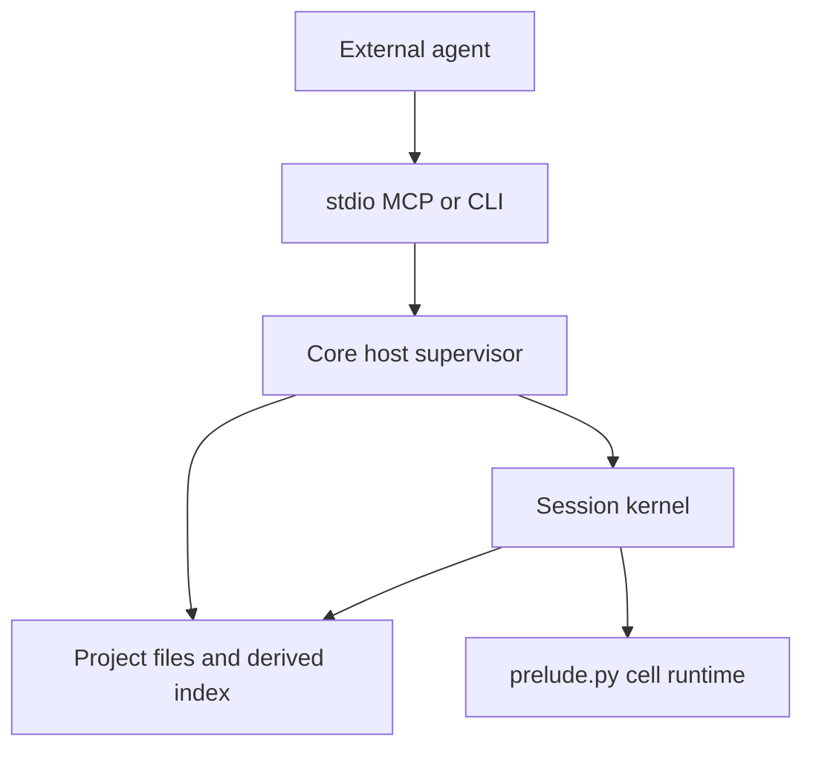

# Implementation guide

This guide maps the Quail specification onto code. It defines ownership,
dependency direction, build order, and the seams that must remain stable
while the implementation is built.

It is not a fourth specification:

- `docs/api.md` owns agent-visible behavior.
- `docs/storage.md` owns durable files, the derived index, replay, and
  expression-to-SQL semantics.
- `docs/kernel.md` owns process behavior, limits, tools, CLI, and Hosted
  seams.

When this guide appears to disagree with one of those documents, the
document wins. When the documents disagree with each other, do not hide a
choice in code or here; resolve the owning specification before implementing
that slice.

The implementation should be small because the boundaries are strong, not
because behavior is duplicated or deferred.

## 1. Shape

Quail has two processes and one durable project:



The host supervisor may read project files and contact the configured
embedding provider. The kernel receives already-open handles, then loses
filesystem and network access. Hosted replaces host policy and process
placement; it does not replace Core storage, language, or query semantics.

Four rules organize the implementation:

1. **Text is truth.** The manifest, CSVs, and session logs are durable.
   SQLite, FTS state, chunk mappings, and vectors are rebuildable.
2. **The kernel owns semantics.** Expressions, predicates, verbs, SQL
   compilation, and notebook-cell behavior exist only in `prelude.py`.
3. **The host owns capabilities.** Paths, locks, spawning, embedding HTTP,
   and external adapters stay outside the kernel.
4. **Adapters contain no product logic.** MCP and CLI translate arguments
   into the same host service and translate its result back.

Core is an environment, not an agent harness. It does not call a model,
spawn subagents, expose shell/file tools inside cells, or run Git.

## 2. Source layout and dependency direction

Keep `quail/__init__.py` side-effect free. Python imports it before
`python -m quail.prelude`; eager host-side re-exports there would pull the
host dependency graph into kernel startup.

| Module | Owns | May depend on | Must not contain |
| --- | --- | --- | --- |
| `project.py` | Manifest, paths, session metadata, log parsing, replay map, locks | Standard library | SQLite, HTTP, MCP, expression logic |
| `index.py` | CSV import/rebuild, SQLite schema, FTS build, warm-pack ingestion | `project.py`, SQLite | Provider HTTP, kernel lifecycle, MCP |
| `embed.py` | Provider configuration, batching, retries, embedding request | `project.py`, HTTP client | Passage splitting, SQLite writes, MCP |
| `prelude.py` | Kernel bootstrap, language, compiler, verbs, replay application, cell loop, confinement | Standard library, RE2, optional NumPy | Any `quail.*` import, HTTP, MCP, CSV import |
| `kernel.py` | Session subprocess, control protocol, timers, restart, embedding forwarding | `project.py`, `embed.py` | SQL or language implementation |
| `tools.py` | Reusable host service and warm orchestration | `project.py`, `index.py`, `embed.py`, `kernel.py` | MCP types, argparse, expression internals |
| `mcp.py` | Stdio MCP adapter | `tools.py`, MCP SDK | A second copy of tool behavior |
| `cli.py` | Command parsing and presentation | Host modules | In-process evaluation of agent code |

`prelude.py` is deliberately self-contained. Organize it into ordinary
private classes and functions, but do not split runtime behavior into modules
that the confined process must import. Small rules duplicated between host
and prelude—log replay ordering and passage splitting—must be checked against
shared fixtures so they cannot drift.

## 3. Build in vertical slices

Each step should leave a tested, coherent capability. Do not create empty
facades for later steps and do not implement a temporary second engine.

| Step | Deliverable | Proof |
| --- | --- | --- |
| 1 | Packaging, inert `__init__.py`, project manifest and errors | A project loads and invalid input fails clearly |
| 2 | Sessions, log parser, replay map, fork, and locks | Logs deterministically recover final tag values |
| 3 | CSV import and complete disposable SQLite index | Deleting the index and reopening reproduces it |
| 4 | Prelude language, compiler, and verbs without semantic search | API examples execute against the real index |
| 5 | Cell loop, tag transaction, logging, and confinement | A successful or failed cell has exactly the documented effects |
| 6 | Host kernel lifecycle and embedding control path | A process can run, time out, restart, and request embeddings |
| 7 | Semantic search and local warming | First use embeds; later use reuses vectors |
| 8 | Shareable warm shards | Independent workers produce mergeable vector packs |
| 9 | Host service, stdio MCP, and CLI | Every surface exercises the same implementation |

Lexical search belongs in the index/compiler slices: FTS is built during CSV
import. Semantic search belongs after the host/kernel embedding channel
exists.

## 4. Cross-cutting flows

### Opening a dataset

There is one host entry path for opening work:

1. Load and validate the project.
2. Ensure the dataset index exists and matches the CSV hash.
3. Rebuild the index when required.
4. Ingest compatible shareable warm packs into the derived vector table.
5. Acquire the session lock.
6. Spawn or reuse the session kernel.
7. Let the kernel compare the session log digest with `applied` and replay
   when needed.

`setup`, `exec`, CLI commands that need the index, and Hosted must use
this path rather than reproducing pieces of it.

Build a replacement index in a temporary path and publish it only after the
build succeeds. Re-import reapplies every session's replay map and records
the corresponding digest, so the next kernel open does not redo the same
work. The index builder never calls the embedding provider.

### Replay

`project.py` owns the pure operation:

```text
session log files → ordered successful writes → final (entry, field) values
```

`index.py` uses it after a CSV rebuild. `prelude.py` implements the same
specified ordering when an existing index is behind a pulled log. Both use
the same fixture corpus and expected replay result.

Malformed-line handling, ordering, deletion by `null`, and orphan counting
come directly from `docs/storage.md`. Entry IDs—not SQLite rowids—cross the
durable boundary.

Use one deterministic digest algorithm in both processes: sort log files by
their project-relative POSIX path and hash each path plus its exact bytes.
The digest is a cache marker, not user-visible history.

### A cell

Implement the sequence in `docs/kernel.md` literally:

1. Parse and validate the cell.
2. Begin the tag transaction.
3. Arm limits and capture output.
4. Execute statements and display the final expression.
5. On success, append and sync the successful log record, then commit the
   derived tag state and advance its applied digest.
6. On failure, roll back tag state, keep ordinary Python assignments, append
   the failed-cell record, and return the cleaned traceback.
7. Restore process state and return one bounded result.

The log is durable truth. SQLite must never contain a committed tag write
that cannot be recovered from the log. Any optimization of this sequence
must preserve that invariant.

Tag changes made earlier in a cell are visible to later lines in that cell,
including a newly created tag field. Rollback restores both values and the
field catalog.

### Errors

Keep the boundary simple:

- A cell syntax/runtime/Quail error is an `exec` result. Iterating on cells
  is normal.
- A project, session-lock, spawn, or protocol failure is a host
  `QuailError`.
- Both serialize as `{type, message, hint}`.
- MCP and CLI format the same host result; neither interprets cell code.

### Confinement

The kernel opens everything it needs before installing the audit hook and
network isolation. The host passes only project/session identifiers, limits,
and already-open control/data handles. Provider credentials remain in the
host.

Confinement in Core prevents ordinary accidental access; it is not a
multi-tenant security boundary. Hosted supplies the container or microVM.
Do not add a Python-syntax allow-list.

### Concurrency

- One live kernel owns one session lock.
- Calls into one kernel are serialized.
- Different sessions use separate connections to the same WAL database.
- SQLite still has one writer; busy failures must become a clear, bounded
  host or cell error rather than an unhandled SQLite exception.
- Derived cache work may be repeated, but it must be idempotent.

## 5. Module contracts

### `quail/project.py`

Expose one `Project(path)` seam and small value objects for validated
dataset/session configuration.

It must:

- Resolve all project paths from the manifest root.
- Validate the manifest and provider secret references.
- Validate dataset and session names before using them as path segments.
- Read and write `session.toml`.
- Create/fork sessions without invoking Git.
- Parse run headers and cell records.
- Produce session summaries for setup/CLI.
- Produce the pure replay map and log digest.
- Acquire/release advisory session locks.

It must not open SQLite or append cell records. Only the kernel that owns a
run file appends to that file.

### `quail/index.py`

Expose an idempotent `ensure_index(project, dataset)` operation. It owns the
schema in `docs/storage.md`, imports source cells as text, builds FTS, and
rebuilds when the source hash changes.

Important implementation rules:

- Quote identifiers; bind values.
- Enable WAL and set the busy timeout on every connection.
- Build FTS for source fields except the canonical ID.
- Keep tag values as JSON text and vectors as little-endian float32.
- On rebuild, preserve compatible content-addressed vectors, reconstruct
  source chunk mappings, replay every session, and report orphan IDs.
- Ingest compatible warm packs before a kernel is spawned.
- Enumerate deterministic source-passage work and read/write warm packs for
  the host warming path.
- Treat the entire file as disposable; schema-version mismatch rebuilds it
  rather than migrating user truth.

CSV validation should fail at import with the source row/header in the
message. Do not allow a malformed input to become a later SQL error.

### `quail/embed.py`

Expose one batch operation:

```python
embed(project, dataset, texts) -> list[list[float]]
```

It resolves the configured provider, reads the referenced credential at call
time, batches requests, retries only transient failures, and preserves input
order. It validates that all values are finite and every returned vector has
the same nonzero dimension, then returns that dimension to the kernel.

It does not split text, hash passages, write SQLite, or know about fields.
Those are kernel/index concerns. Hosted may replace this call with its own
provider callback.

### `quail/prelude.py`

This file is the kernel executable. Keep its internal sections in execution
order:

1. Wire/error/value types.
2. Expression and predicate nodes.
3. Pipeline produce checking.
4. SQL compiler and registered SQLite functions.
5. Entry and verbs.
6. Lexical and semantic preparation/scoring.
7. Replay application.
8. Cell execution.
9. Bootstrap and confinement.
10. Control loop.

Implement the method table and verb signatures from `docs/api.md`; implement
SQL shapes and registered functions from `docs/storage.md`. Do not duplicate
those tables in comments or invent parallel Python evaluation semantics.

The user namespace contains exactly the documented public names and the
documented pre-imported modules. The same names are available on the
`quail` recovery object. A generated contract test compares the namespace
with code references in `docs/api.md`.

The database connection, log handle, compiler context, and control channel
are runtime internals. Core accepts that determined introspection can reach
them; do not distort the design trying to make in-process Python a security
boundary.

### `quail/kernel.py`

`Kernel(project, session, spawn=...)` owns:

- The session lock and subprocess lifetime.
- Startup arguments and ready handshake.
- One-at-a-time cell execution.
- Wall timeout, interruption, kill, and restart reporting.
- The host side of embedding requests.
- Clean shutdown and reset.

The local spawn starts `python -m quail.prelude`. Hosted may substitute a
container/microVM spawn that speaks the same protocol. `kernel.py` never
imports prelude as a library.

The host process needs one service instance that owns its active
`session -> Kernel` map. Do not hide live kernels in module globals.

### `quail/tools.py`

Provide the four operations described in `docs/kernel.md`:

- `setup`
- `exec`
- `export`
- `reset`

They share one process-local service instance and the dataset-open path from
section 4. This is the reusable boundary for MCP, CLI, and Hosted.

`exec` is the only operation that evaluates a cell. It creates/forks a
session when required, reuses its kernel, and returns cell failures without
turning them into tool failures. `reset` drops only the live Python
process; committed tags remain.

The same service has a CLI/host operation for `warm`. It asks `index.py`
for source passages, calls `embed.py` in batches, and gives the vectors
back to `index.py` for validation, cache insertion, and optional pack
writing. It does not start a session, execute a synthetic cell, or write a
session log.

### `quail/mcp.py`

Register the four stdio tools and delegate immediately to the host service.
No authentication, SQL, session rules, or error reinterpretation belongs
here.

Package `docs/api.md` as data and return that exact text from setup; never
resolve it relative to the caller's working directory.

### `quail/cli.py`

Implement the command list in `docs/kernel.md`. Commands call the same host
operations as MCP.

`quail exec` creates a transient service/kernel, runs one cell, prints the
result, and closes it. Tags persist through the log; Python variables do not
persist between separate CLI invocations.

`quail warm` calls the host service's warm operation. It does not evaluate
agent code.

## 6. Warming

### What warming means

Warming is **semantic preparation only**.

Lexical search is already prepared when `index.py` imports the CSV and
builds FTS; lexical rows for tag fields are maintained when tags are
written. There is no provider call and no useful separate lexical warm step.

Semantic search requires more work:

1. Split each selected source cell into the passages defined by
   `docs/storage.md`.
2. Hash and deduplicate those passages.
3. Embed hashes missing from the vector cache.
4. Record the passage-to-entry mapping in `chunks`.

Without an explicit warm, the first `.semantic()` performs that work.
`quail warm DATASET [--field FIELD]` performs it ahead of time. Warming is
an optimization only; warm and cold queries must return identical scores.
It prepares corpus vectors, not future query strings.

Lazy warming belongs to `prelude.py`: a semantic query discovers a missing
vector and asks the host to embed it. Explicit CLI warming is a host batch
path: `tools.py` coordinates passage inventory and cache writes in
`index.py` with provider calls in `embed.py`. It does not spawn a kernel.
Both paths use the same passage-splitting fixtures and vector representation.

### Shareable warm shards

Add one optional argument:

```text
quail warm DATASET [--field FIELD] [--shard I/N]
```

Without `--shard`, warm all selected source passages into the local
gitignored SQLite cache, as already described by the specification.

With `--shard I/N`:

- `I` is one-based and `1 <= I <= N`.
- Build the distinct passage set for the selected source field, or all
  non-ID source fields when `--field` is omitted.
- Assign a passage to shard `I` when its SHA-256 integer modulo `N`
  equals `I - 1`.
- Embed only that shard.
- Insert the vectors into the local cache.
- Write a shareable warm pack under `warm/`.
- Report selected, reused, and newly embedded passage counts plus the pack
  path.

Hash partitioning makes assignment deterministic without a coordinator.
Workers only need the same Git revision, embedding configuration, field
selection, and shard count.

Use this layout:

```text
warm/
  <dataset>/
    <source-hash>/
      <plan-hash>/
        part-0001-of-0008.jsonl
```

`plan-hash` is the SHA-256 of canonical JSON containing the embedding
model string, sorted field names, chunker format version, and shard count.
The file begins with one header record:

```json
{"quail_warm":1,"dataset":"notes","source_hash":"…","embed":"ollama/embeddinggemma:latest","fields":["body"],"dims":768,"shard":[1,8]}
```

Each remaining line is sorted by text hash and contains one vector:

```json
{"text_hash":"sha256:…","vector":"<base64 little-endian float32>"}
```

The passage text and entry rowids are not included. The CSV reconstructs
passage-to-entry mappings cheaply and deterministically; only the expensive
vectors need to travel. This also keeps packs reusable within every repeated
passage in the selected corpus.

Warm packs are derived, shareable cache—not analysis truth. Quail writes the
pack atomically and prints its path; it never commits or pushes it. Separate
workers write separate part files, so ordinary Git merges take their union
without line-level conflicts. Choose enough shards to keep each file
comfortably below the Git host's file-size limit.

Write a header-only pack when a shard has no passages. File presence then
records completed work without a separate manifest.

On dataset open, `index.py` scans packs for the current dataset and source
hash. It accepts only matching embedding configuration, field plan, vector
dimension, and format version, then inserts by `(model, text_hash)`.
Identical duplicates are ignored; a duplicate hash with different bytes is
an error. Missing parts are fine: the next semantic warm/query embeds only
the hashes still absent.

Keep the first version deliberately narrow:

- Source fields only. Session-specific tag fields continue to warm lazily
  inside their session.
- One vector format and one chunker version.
- No coordinator, manifest of workers, remote cache service, Git API, or
  completeness database.
- No automatic repartitioning. Start another plan with a different `N` if
  needed.
- An already-running kernel sees newly pulled packs after reset/reopen; do
  not add live cache invalidation.

Example with four workers:

```sh
quail warm notes --field body --shard 1/4
quail warm notes --field body --shard 2/4
quail warm notes --field body --shard 3/4
quail warm notes --field body --shard 4/4
```

Each worker commits its one file. After the branches are merged and pulled,
the next dataset open imports all four packs into the local SQLite cache.

## 7. Verification

Tests should prove boundaries and durable behavior, not mirror module
internals.

### Contract tests

- Every public prelude name appears in `docs/api.md`, and every documented
  name exists.
- Every expression method accepts and produces exactly the documented
  pipeline type.
- MCP and CLI are thin adapters over the same host service.
- `quail/__init__.py` does not import the host graph during prelude startup.

### Durable-state tests

- Deleting SQLite and reopening reconstructs source rows and session tags.
- Host replay and prelude replay produce the same result from shared fixtures.
- A failed cell never leaves a durable tag write.
- Crash points around log sync and SQLite commit recover from the log.
- Re-import preserves compatible vectors, reapplies tags, and reports
  orphaned IDs.
- Fork copies history without sharing mutable files.

### Engine tests

- Compiler cases cover every row in the expression/predicate tables.
- SQL three-valued logic is reduced to the documented two-valued predicates.
- Lexical tests distinguish absent, no-match, and positive score.
- Warm and cold semantic queries return the same result.
- Passage splitting is identical in `index.py` and `prelude.py`.
- Limits roll back tags and report whether the kernel restarted.

### Warm-shard tests

- Shards are disjoint and their union equals the full distinct passage set.
- Assignment is independent of CSV row order and worker.
- Packs are byte-stable for identical deterministic provider output.
- Partial pack sets import successfully and missing hashes embed lazily.
- Merging pack directories requires no content merge.
- Wrong source/model/dimensions/version is rejected.
- Duplicate identical vectors are ignored; conflicting vectors fail.

Keep performance checks coarse and representative: project open, count,
retrieve, lexical search, warm semantic search, and bulk tag commit on a
fixed corpus. Do not bake machine-specific millisecond promises into the
product specification.

## 8. Specification gates

The current canonical documents contain a few choices that cannot be
implemented simultaneously. Resolve each in its owning document when that
slice begins; do not let the guide silently become authoritative:

1. **Late imports and the audit hook.** `api.md` permits ordinary standard
   library imports, while `kernel.md` denies every later `open` event.
   Importing a module that is not already loaded normally opens its source.
2. **Search after transformation.** The API method table permits
   `.slice(...).lexical(...)` and similar pipelines, while the storage
   compiler defines search through a persisted field index. Choose a single
   semantic path before implementing search.
3. **Method return wording.** `api.md` says every pipeline method returns
   an `Expression`, while its table says `.isin` and `.contains` return
   a predicate. The table and verb examples require `Predicate`.
4. **Embedding dimensions.** The kernel learns dimensions on first embed,
   but the documented SQLite authorizer does not grant the required
   `meta.embed_dims` update.
5. **Applied digest after failed cells.** Failed cells change the log digest
   without changing tags. Decide whether their append advances `applied` or
   intentionally causes a replay on next open.
6. **Operations on `any`.** Tags may contain dictionaries and mixed JSON
   values, while several `q_*` descriptions define only scalar/array
   behavior. Specify the per-value result for text, regex, length, slicing,
   containment, grouping, and search.
7. **Seeded random after re-import.** Storage keys `Random(seed)` by SQLite
   rowid, which can change when a CSV is rebuilt. Decide whether a seeded
   sample is stable only for one index build or across builds by entry ID.
8. **Rebuild with live kernels.** Automatic CSV re-import can replace the
   index while kernels still hold connections to it. Choose fail/wait/restart
   behavior before implementing automatic rebuild.
9. **Who may contact the embedding provider.** The manifest and kernel
   require host-side embedding HTTP, while the broad statement “Core never
   contacts a remote” appears elsewhere. Distinguish the networkless kernel
   from the Core host supervisor.

Everything else should be implemented directly from the three specification
documents. Avoid adding extension points, registries, alternate backends, or
abstraction layers until a second real implementation needs them.
