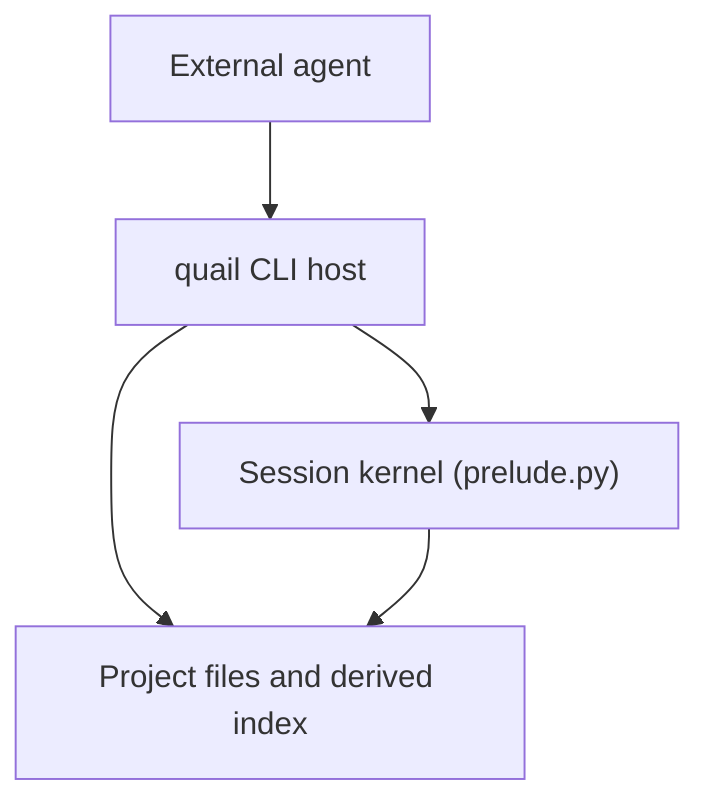

# Implementation guide

This guide maps the Quail specification onto code. It defines ownership,
dependency direction, build order, and the seams that must remain stable
while the implementation is built.

The documents under `docs/` define the base design:

- `docs/api.md` owns agent-visible behavior.
- `docs/storage.md` owns durable files, the derived index, replay, and
  expression-to-SQL semantics.
- `docs/kernel.md` owns process behavior, limits, the CLI, and Hosted
  seams.

This guide contains binding implementation decisions where those documents
conflict, leave behavior open, or predate an approved direction. Those
decisions are collected in section 8 and override only the behavior they name.
Everywhere else, the owning document remains authoritative. Do not extend an
override by analogy or hide another choice in code.

Two approved directions account for most of the differences:

- Semantic indexing embeds each complete field value once. It does not split
  values into passages.
- Core has one local user-facing interface: the `quail` CLI. A foreground
  streaming `quail exec` process holds the persistent kernel. MCP belongs to
  the future Hosted repository.

The implementation should be small because the boundaries are strong, not
because behavior is duplicated or deferred.

## 1. Shape

Quail has two processes and one durable project:



The foreground CLI process may read project files and contact the configured
embedding provider. For a streaming execution it owns one kernel for the
life of the command. During privileged bootstrap the kernel opens its index
and run log; it then loses filesystem and network access. Hosted imports the
same Core operations and adds MCP, server lifecycle, and policy; it does not
replace Core storage, language, or query semantics.

Four rules organize the implementation:

1. **Text is truth.** The manifest, CSVs, and session logs are durable.
   SQLite, FTS state, value mappings, and vectors are rebuildable.
2. **The kernel owns semantics.** Expressions, predicates, verbs, SQL
   compilation, and notebook-cell behavior exist only in `prelude.py`.
3. **The host owns capabilities.** Paths, locks, spawning, and embedding HTTP
   stay outside the kernel.
4. **The CLI contains no product logic.** It translates arguments and stream
   records into calls to transport-neutral Core operations.

Core is an environment, not an agent harness. It does not call a model,
spawn subagents, expose shell/file tools inside cells, run Git, or serve MCP.
The Core runtime targets Linux and macOS, whose advisory locks and process
signals the kernel contract already requires; do not add a Windows shim.

## 2. Source layout and dependency direction

Keep `quail/__init__.py` side-effect free. Python imports it before running
`quail.prelude` as a module; eager host-side re-exports there would pull the
host dependency graph into kernel startup.

| Module | Owns | May depend on | Must not contain |
| --- | --- | --- | --- |
| `project.py` | Manifest, paths, session metadata, log parsing, replay map, session/dataset locks | Standard library | SQLite, HTTP, CLI, expression logic |
| `index.py` | CSV import/rebuild, SQLite schema, FTS build, warm-pack ingestion | `project.py`, SQLite | Provider HTTP, kernel lifecycle, CLI |
| `embed.py` | Provider configuration, batching, retries, embedding request | `project.py`, HTTP client | Text segmentation, SQLite writes, CLI |
| `prelude.py` | Kernel bootstrap, language, compiler, verbs, replay application, cell loop, confinement | Standard library, RE2, optional NumPy | Any `quail.*` import, HTTP, CLI, CSV import |
| `kernel.py` | Session subprocess, control protocol, timers, memory monitor, restart, embedding forwarding | `project.py`, `embed.py`, standard library | SQL or language implementation |
| `service.py` | Transport-neutral Core operations and warm orchestration | `project.py`, `index.py`, `embed.py`, `kernel.py` | Argparse, process-global kernels, expression internals |
| `cli.py` | Command parsing, presentation, and the foreground exec stream | `project.py`, `service.py`, `kernel.py` | SQL, provider wire formats, in-process evaluation of agent code |

`prelude.py` is deliberately self-contained. Organize it into ordinary
private classes and functions, but do not split runtime behavior into modules
that the confined process must import. Log replay ordering is duplicated
between host and prelude; check both implementations against the same fixtures
so they cannot drift.

## 3. Build in vertical slices

Each step should leave a tested, coherent capability. Do not create empty
facades for later steps and do not implement a temporary second engine.

| Step | Deliverable | Proof |
| --- | --- | --- |
| 1 | Packaging, inert `__init__.py`, project manifest and errors | A project loads and invalid input fails clearly |
| 2 | Sessions, log parser, replay map, fork, and locks | Logs deterministically recover final tag values |
| 3 | CSV import and complete disposable SQLite index | Deleting the index and reopening reproduces it |
| 4 | Prelude language, compiler, and verbs without semantic search | API examples execute against the real index |
| 5 | Cell loop, tag transaction, logging, and confinement | A successful or failed cell has exactly the documented effects |
| 6 | Host kernel lifecycle and embedding control path | A process can run, time out, restart, and request embeddings |
| 7 | Semantic search and local warming | First use embeds; later use reuses vectors |
| 8 | Shareable warm shards | Independent workers produce mergeable vector packs |
| 9 | Core operations and the CLI | One-shot commands and a persistent exec stream exercise the same implementation |

Lexical search belongs in the index/compiler slices: FTS is built during CSV
import. Semantic search belongs after the host/kernel embedding channel
exists.

## 4. Cross-cutting flows

### Opening data and a session

Every host operation that needs derived data uses one dataset path:

1. Load and validate the project and dataset.
2. Under a shared dataset lock, check that the index exists and matches the
   source and import configuration.
3. If it is stale, release the shared lock, acquire the lock exclusively, and
   check again before rebuilding. If another process holds the lock, fail
   clearly instead of replacing a live index.
4. Once the index is current, hold or reacquire a shared lock for the rest of
   the operation and ingest compatible shareable warm packs.

Opening a live session continues from there:

1. Resolve, create, or fork the session.
2. Acquire its lock.
3. Synchronize its log into the index when its digest differs from `applied`.
4. Spawn the kernel while retaining the shared dataset lock and session lock.

`service.py` owns both sequences. Setup and warm stop after the dataset work
they need. Fields and export synchronize a closed session before reading it;
when its kernel is already open, they read one committed WAL snapshot without
replay. `open_session` performs the full sequence. The CLI and future Hosted
never reproduce either sequence.

Build a replacement index in a temporary path and publish it only after the
build succeeds. Re-import reapplies every session's replay map and records
the corresponding digest, so the next kernel open does not redo the same
work. The index builder never calls the embedding provider.

### Replay

`project.py` owns the pure operation:

```text
session log files → ordered successful writes → final (entry, field) values
```

`index.py` uses it after a CSV rebuild. `prelude.py` implements the same
specified ordering when an existing index is behind a pulled log. Both use
the same fixture corpus and expected replay result.

Malformed JSON or a cell record that fails schema validation is ignored as a
whole and reported; replay never partially applies a record. Entry IDs—not
SQLite rowids—cross the durable boundary. Resolve the final replay map by ID,
skip IDs absent from the current source, and count one orphan for each final
non-`null` `(entry_id, field)` pair. A final clear is not an orphan. Missing
IDs do not prevent synchronization or advancement of `applied`.

Use one deterministic digest algorithm in both processes. For each log file,
compute the SHA-256 of its exact bytes. Sort `[project-relative POSIX path,
hex digest]` pairs by path, encode that list as compact UTF-8 JSON, and hash
those bytes once more. Prefix the result with `sha256:`. The kernel can update
the digest of its current run incrementally instead of re-reading the full
history after every cell. The session digest is a cache marker, not
user-visible history.

### A cell

Implement one cell in this order:

1. Parse and validate the cell.
2. Begin the tag transaction.
3. Arm limits and capture output.
4. Execute statements and display the final expression.
5. Finalize and bound the output before constructing the cell record, so the
   log and returned result contain the same output.
6. On success, append and sync the record, update `applied` in the open tag
   transaction, then commit both together.
7. On failure, roll back tag state, keep ordinary Python assignments, append
   and sync the failed-cell record, then advance `applied` in a small
   tag-free transaction.
8. Restore process state and return the result.

The log is durable truth. SQLite must never contain a committed tag write
that cannot be recovered from the log. Any optimization of this sequence
must preserve that invariant.

Tag changes made earlier in a cell are visible to later lines in that cell,
including a newly created tag field. Rollback restores both values and the
field catalog.

### Errors

Keep the boundary simple:

- A cell syntax/runtime/Quail error is an `exec` result. Iterating on cells
  is normal.
- A project, session-lock, spawn, or protocol failure is a host
  `QuailError`.
- Both serialize as `{type, message, hint}`.
- The CLI returns Core results without interpreting cell code. Hosted may map
  the same results onto MCP later.

### Confinement

The kernel opens everything it needs before installing the audit hook and
network isolation. The host passes only project/session identifiers, limits,
and the control channel; the prelude opens the index and run log during
bootstrap. Spawn it with a minimal environment that excludes provider keys
and unrelated host secrets. Provider credentials remain in the host.

The standard library promised by `docs/api.md` remains importable. The audit
hook permits read-only access beneath the resolved standard-library roots and
denies writes and every other path; the cell-facing `open` remains disabled.
RE2 and optional NumPy are loaded before confinement. This narrow path
exception is for Python's loaders, not a general filesystem API. Do not add
import-state machinery, an AST allow-list, or a module allow-list.

Confinement in Core prevents ordinary accidental access; it is not a
multi-tenant security boundary. Hosted supplies the container or microVM.
Do not add a Python-syntax allow-list.

### Concurrency

- One foreground exec stream owns one kernel and one session lock.
- A stream accepts one request at a time, so its cells are naturally
  serialized.
- Different sessions run in different CLI/kernel process pairs with separate
  connections to the same WAL database and shared locks on that dataset.
- A second stream for an already-open session gets the ordinary session-lock
  error; Core has no daemon in which to queue it.
- Read-only fields and export operations may use the committed SQLite state of
  that open session; they never inspect a half-finished tag transaction.
- Index replacement requires the dataset lock exclusively. If the source
  changes while any kernel for that dataset is open, the opener reports that
  those kernels must be closed; it does not wait or restart them.
- SQLite still has one writer; busy failures must become a clear, bounded
  host or cell error rather than an unhandled SQLite exception.
- Derived cache work may be repeated, but it must be idempotent.

## 5. Module contracts

### `quail/project.py`

Expose one `Project(path)` seam and small value objects for validated
dataset/session configuration.

It must:

- Resolve all project paths from the manifest root.
- When the CLI supplies no explicit root, find the nearest `quail.toml` in
  the current directory or one of its parents; fail if none exists.
- Validate the manifest and provider secret references.
- Validate dataset and session names as non-empty single path segments before
  using them. Reject `.`, `..`, separators, and NUL; never rewrite a name.
- Read and write `session.toml`.
- Create/fork sessions without invoking Git. A fork destination is the new
  session name and must not exist; lock the source while copying its log.
- Parse run headers and cell records.
- Produce session summaries for setup/CLI.
- Produce the pure replay map and log digest.
- Acquire/release advisory session and dataset locks.

Project initialization completes the existing `quail init [DIR]` contract; it
does not invent another setup workflow. Create `DIR` when absent, refuse to
overwrite an existing `quail.toml`, and write exactly this initial manifest:

```toml
[project]
quail = "1"
```

Ensure `sessions/` exists and add the documented ignore rules while preserving
any existing `.gitignore`. Do not create a dataset or session, run Git, or
create derived storage.

It must not open SQLite or append cell records. Only the kernel that owns a
run file appends to that file.

### `quail/index.py`

Expose an idempotent `ensure_index(project, dataset)` operation. It owns the
schema in `docs/storage.md`, imports source cells as text, builds FTS, and
rebuilds when the source hash or import configuration changes. It also exposes
one `sync_session` operation for applying a closed session's log before a
host-side read.

Important implementation rules:

- Quote identifiers; bind values.
- Enable WAL and set the busy timeout on every connection.
- Define `source_hash` as `sha256:` plus the SHA-256 hex digest of the CSV's
  exact bytes. Track the resolved import configuration separately when
  deciding whether the index is current.
- Expose exactly one canonical source field named `id`. The configured source
  column supplies it and is not duplicated under a second name. When no
  column is configured, a source column named exactly `id` supplies it;
  otherwise synthesize IDs. The public name `id` is reserved: selecting a
  differently named ID column while another source column is named `id` is an
  import error. Other identifier-like columns remain ordinary fields. Build
  FTS for every other source field.
- Keep tag values as canonical JSON text and vectors as little-endian float32.
- On rebuild, preserve compatible content-addressed vectors, reconstruct
  source-value mappings, replay every session, and report orphan IDs.
- Ingest compatible warm packs before a kernel is spawned.
- Enumerate deterministic source-value work and read/write warm packs for
  the host warming path.
- Treat the entire file as disposable; schema-version mismatch rebuilds it
  rather than migrating user truth.

For whole-value semantics, replace the specification's `chunks` table with
exactly one mapping table:

```sql
CREATE TABLE semantic_values (
  session TEXT NOT NULL,
  field TEXT NOT NULL,
  entry INTEGER NOT NULL REFERENCES entries(rowid),
  text_hash TEXT NOT NULL,
  PRIMARY KEY (session, field, entry)
);
```

There is no passage number or second mapping table. Source fields use the
empty session name and tag fields use their owning session. Vector dimensions
are validated per exact configured `embed` string from existing vector blob
lengths, not stored as one mutable `meta.embed_dims` value. The `model` key in
`vectors` stores that exact string. Provider wire shape and base URL route
requests but are not part of the cache identity.

A tag write deletes the touched `semantic_values` rows; the next semantic
read recreates their whole-value mappings and embeds only hashes not already
in `vectors`.

CSV validation should fail at import with the source row/header in the
message. Reject empty headers, NUL in a header, names that collide under
SQLite's case-insensitive lookup, an unselected name that collides with the
canonical `id`, internal `rowid`, or FTS5's reserved `rank`, inconsistent row
width, ID violations, and a field count beyond the active SQLite build's
column limit before publishing an index. Quoted unusual headers are otherwise
valid. Do not allow malformed input to become a later SQL error.

### `quail/embed.py`

Expose one batch operation:

```python
embed(project, dataset, texts) -> list[list[float]]
```

It resolves the configured provider, reads the referenced credential at call
time, batches requests, retries only transient failures, and preserves input
order. It validates that all values are finite and every returned vector has
the same nonzero dimension and norm, then returns those vectors to the caller.
Every HTTP attempt has a finite private timeout and the retry count is fixed;
do not add provider tuning to `quail.toml` without an observed need.

It does not segment text, hash values, write SQLite, or know about fields.
Those are kernel/index concerns. Hosted may replace this call with its own
provider callback.

### `quail/prelude.py`

This file is the kernel executable. Keep its internal sections in execution
order:

1. Wire/error/value types.
2. Expression and predicate nodes.
3. Pipeline produce checking.
4. SQL compiler and registered SQLite functions.
5. Entry and verbs.
6. Lexical and semantic preparation/scoring.
7. Replay application.
8. Cell execution.
9. Bootstrap and confinement.
10. Control loop.

Implement the method table and verb signatures from `docs/api.md`; implement
SQL shapes and registered functions from `docs/storage.md`. Do not duplicate
those tables in comments or invent parallel Python evaluation semantics.

The user namespace contains exactly the documented public names and the
documented pre-imported modules. The same names are available on the
`quail` recovery object. A contract test uses one explicit expected namespace
and checks those public names against `docs/api.md`; do not infer the set from
every code span, which also contains transport and example names.

The database connection, log handle, compiler context, and control channel
are runtime internals. Core accepts that determined introspection can reach
them; do not distort the design trying to make in-process Python a security
boundary.

### `quail/kernel.py`

`Kernel(project, session, spawn=..., embed_fn=...)` owns:

- The session lock and subprocess lifetime.
- Startup arguments and ready handshake.
- One-at-a-time cell execution.
- Wall timeout, interruption, kill, and restart reporting.
- The host side of embedding requests.
- Clean shutdown and reset.

The local spawn starts `[sys.executable, "-m", "quail.prelude"]`. Hosted may
substitute a container/microVM spawn that speaks the same protocol.
`kernel.py` never imports prelude as a library.

The host watches resident memory rather than using `RLIMIT_AS`, which limits
address space rather than actual memory. Exceeding `memory_mb` kills and
restarts the kernel; CPU and wall budgets remain fresh per cell, while memory
is a kernel-wide ceiling. Provider wait pauses the cell wall budget but remains
bounded by the embedding client's own request timeout.

Never rerun a cell after an unexpected kernel exit. Check the dead run's last
complete record: if that cell was durably logged, restart, replay, and return
the recorded result with `kernel_restarted`; otherwise return a kernel-failure
result after restarting. The log-before-commit invariant makes these the only
two outcomes.

The caller owns the returned `Kernel`. Core has no active-kernel registry,
daemon, socket, or background supervisor. The foreground streaming CLI owns
one; future Hosted may own many. `Kernel.reset()` keeps the same session lock,
dataset lock, and index, replaces only the subprocess, and starts a new run.
It resets notebook working memory; it is not a dataset reopen.

### `quail/service.py`

This module is a set of transport-neutral host operations, not a service
object. It provides project initialization/import, `setup`, `open_session`,
session listing/forking, fields, export, and warm.

`open_session` performs the shared dataset-open path, creates or forks the
session when required, synchronizes its log, and returns one `Kernel`. Its
caller is responsible for closing that kernel. Cell execution and reset are
methods on the returned kernel because that is where the live state exists.

An existing session rejects `fork_from`; `dataset`, when supplied, must match.
A new session inherits the source dataset when forked, otherwise uses the
requested dataset or the project's sole dataset. More than one possible
dataset is an error. Setup lists named sessions but never allocates a session
or opens a kernel.

`warm(..., embed_fn=None)` asks `index.py` for source values, uses the supplied
embedding callback or `embed.py` in batches, and gives the vectors back to
`index.py` for validation, cache insertion, and optional pack writing. It does
not start a session, execute a synthetic cell, or write a session log.

Package `docs/api.md` as data and return that exact text from `setup`; never
resolve it relative to the caller's working directory. This module contains
orchestration only: no argparse, SQL, provider wire formats, or expression
logic.

### `quail/cli.py`

The CLI is Core's only local user-facing interface. Its one-shot commands
delegate to `service.py`; they do not implement project or query behavior.

`quail exec SESSION --stream` is the notebook-shaped path. It opens one
kernel and keeps it for the lifetime of the foreground command. Standard
input and output use a minimal JSON-lines exchange:

```json
{"op":"exec","code":"x = 10"}
{"op":"exec","code":"x + 1"}
{"op":"reset"}
```

The command writes one ready record at startup and exactly one result record
per request. Requests are sequential; there are no request IDs, concurrent
cells, or multiplexing. Cell stdout and stderr stay inside the cell result,
so the CLI's stdout remains valid JSONL. Human diagnostics go to stderr.

`quail setup` presents the exact packaged agent document and the project
summary returned by `service.py`. Because that base document still names the
MCP calls that Hosted will expose, Core prefixes its human output with a short
interface note. With `--json`, it adds this sibling of `documentation`,
`datasets`, and `sessions`:

```json
{
  "interface": {
    "setup": "quail setup --json",
    "open": "quail exec SESSION --stream [--dataset D] [--fork-from S]",
    "exec": {"op": "exec", "code": "..."},
    "reset": {"op": "reset"},
    "export": "quail export SESSION --json"
  }
}
```

The session, dataset, and optional fork are chosen by `open`, not repeated in
each `exec` record. The note overrides invocation wording only; it does not
rewrite or maintain a second copy of the agent document.

An `exec` request calls the same `Kernel.exec` on the same kernel, so Python
variables and imports persist. A `reset` request replaces that kernel and
clears working memory while leaving tags and logs intact. EOF or interruption
closes the kernel and releases the session lock.

`quail exec SESSION FILE.py` remains a convenient one-cell form. It opens a
kernel, executes the file as one cell, prints the result, and closes. Tags
persist; Python variables naturally do not survive that process. The file
form and `--stream` are mutually exclusive.

There is no local `quail mcp`, standalone cross-process reset, daemon,
Unix socket, PID file, or namespace serialization. `quail warm` calls the
service warm operation and never evaluates agent code.

## 6. Warming

### What warming means

Warming is **semantic preparation only**.

Lexical search is already prepared when `index.py` imports the CSV and
builds FTS; lexical rows for tag fields are maintained when tags are
written. There is no provider call and no useful separate lexical warm step.

Semantic search requires more work:

1. Read each non-empty value from the selected source field or fields.
2. Hash the exact UTF-8 text and deduplicate complete values.
3. Embed values missing from the vector cache.
4. Record which value hash belongs to each entry and field.

One table cell—one field on one entry—is the atomic semantic unit. A value
is never split into passages, inspected against a model-specific limit, or
silently truncated. Quail sends the complete value to the configured
provider. Any provider rejection is an ordinary embedding error; unsuitable
value lengths are a dataset concern.

A semantic query is embedded whole as well. Its score for an entry is the
cosine similarity to that entry's one field-value vector; there is no
passage-level maximum or other aggregation.

Without an explicit warm, the first `.semantic()` performs that work.
`quail warm DATASET [--field FIELD]` performs it ahead of time. Warming is
an optimization only; warm and cold queries must return identical scores.
It prepares corpus vectors, not future query strings.

Lazy warming belongs to `prelude.py`: a semantic query discovers a missing
vector and asks the host to embed it. Explicit CLI warming is a host batch
path: `service.py` coordinates value inventory and cache writes in
`index.py` with provider calls in `embed.py`. It does not spawn a kernel.
Both paths use the same whole-value hashing and vector representation.

### Shareable warm shards

Add one optional argument:

```text
quail warm DATASET [--field FIELD] [--shard I/N]
```

Without `--shard`, warm all selected source values into the local
gitignored SQLite cache, as already described by the specification.

With `--shard I/N`:

- `I` is one-based and `1 <= I <= N`.
- Build the distinct non-empty value set for the selected source field, or all
  non-ID source fields when `--field` is omitted.
- Reject the canonical ID, a tag field, or an unknown field; explicit packs
  contain source-field work only.
- Sort the values by text hash. For `M` values, shard `I/N` takes indices
  `start <= j < stop`, where `start = ((I - 1) * M) // N` and
  `stop = (I * M) // N`.
- Embed only that shard.
- Insert the vectors into the local cache.
- Write every selected shard vector—reused or newly embedded—to a shareable
  warm pack under `warm/`.
- Report selected, reused, and newly embedded value counts plus the pack
  path.

This divides the deterministic work list into contiguous sections whose sizes
differ by at most one. Workers need only the same source contents, embedding
designation, and field selection; their provider base URLs may differ. Quail
uses the exact configured `embed` string as the cache identity and trusts that
workers using it run compatible model weights. Different shard counts may be
combined: for example, `1/4`, `2/4`, and `2/2` cover the complete list without
overlap.

Use this layout:

```text
warm/
  <dataset>/
    <source-hash>/
      <plan-hash>/
        part-0001-of-0008.jsonl
```

`plan-hash` is the SHA-256 of canonical JSON containing the warm-pack format
version, exact configured `embed` string, sorted field names, and shard count.
Provider wire shape and base URL are deliberately excluded: they describe how
to reach a model, not which declared model produced the vectors. The hash
prevents incompatible warm runs from choosing the same part filenames; it is
not a separate manifest.
The file begins with one header record:

```json
{"quail_warm":1,"dataset":"notes","source_hash":"…","embed":"ollama/embeddinggemma:latest","fields":["body"],"dims":768,"shard":[1,8]}
```

Each remaining line is sorted by text hash and contains one vector:

```json
{"text_hash":"sha256:…","vector":"<base64 little-endian float32>"}
```

The source text and entry rowids are not included. The CSV reconstructs
value-to-entry mappings cheaply and deterministically; only the expensive
vectors need to travel. Repeated identical values share the same vector.

Warm packs are derived, shareable cache—not analysis truth. Quail writes the
pack atomically and prints its path; it never commits or pushes it. Separate
workers write separate part files, so ordinary Git merges take their union
without line-level conflicts. Choose enough shards to keep each file
comfortably below the Git host's file-size limit.

If a shard contains no values, report that fact and do not write a pack.
Warm packs are caches, not completion records.

On dataset open, `index.py` scans packs for the current dataset and source
hash. Validate the complete header and every vector record in one transaction:
the format, configured `embed` string, declared fields, text hashes, base64
payload, finite values, nonzero consistent dimension and norm, and membership
in the current source-value inventory. Then insert by `(model, text_hash)`
with `INSERT OR IGNORE`. A malformed pack contributes nothing. Fields and
shard count describe how a pack was produced; they do not change whether one
of its content-addressed vectors is reusable. Missing parts are fine: the next
semantic warm/query embeds only the hashes still absent.

Keep the first version deliberately narrow:

- Source fields only. Session-specific tag fields continue to warm lazily
  inside their session.
- One vector format and whole-value embedding only.
- No coordinator, manifest of workers, remote cache service, Git API, or
  completeness database.
- No automatic repartitioning. Start another plan with a different `N` if
  needed.
- Newly pulled packs are ingested on the next dataset open. Do not add live
  cache invalidation.

Example with four workers:

```sh
quail warm notes --field body --shard 1/4
quail warm notes --field body --shard 2/4
quail warm notes --field body --shard 3/4
quail warm notes --field body --shard 4/4
```

Each worker commits its one file. After the branches are merged and pulled,
the next dataset open imports all four packs into the local SQLite cache.

## 7. Verification

Tests should prove boundaries and durable behavior, not mirror module
internals.

### Contract tests

- Every public prelude name appears in `docs/api.md`, and every documented
  name exists.
- Every expression method accepts and produces exactly the documented
  pipeline type.
- One-shot and streaming CLI paths delegate to the same Core operations.
- `quail/__init__.py` does not import the host graph during prelude startup.

### Durable-state tests

- Deleting SQLite and reopening reconstructs source rows and session tags.
- Host replay and prelude replay produce the same result from shared fixtures.
- A failed cell never leaves a durable tag write.
- Successful and failed records both advance `applied` without unnecessary
  replay on the next open.
- Crash points around log sync and SQLite commit recover from the log.
- Re-import preserves compatible vectors, reapplies tags, and reports
  final orphaned `(entry_id, field)` pairs without failing.
- A live dataset cannot be replaced; closed-session reads synchronize, while
  open-session fields/export reads see committed tag state only.
- Fork copies history without sharing mutable files and never overwrites its
  destination.

### Engine tests

- Compiler cases cover every row in the expression/predicate tables.
- Search rejects transformed expressions and the canonical ID without
  creating a slow evaluation path.
- Runtime JSON behavior, list grouping, strict verb arguments, and
  `tag(None, ...)` match section 8.
- SQL three-valued logic is reduced to the documented two-valued predicates.
- Lexical tests distinguish absent, no-match, and positive score.
- Warm and cold semantic queries return the same result.
- Each non-empty field value maps to exactly one semantic vector, and long
  values are passed through whole without special handling.
- Limits roll back tags and report whether the kernel restarted.

### Warm-shard tests

- Shards are disjoint and their union equals the full distinct value set.
- Assignment is independent of CSV row order and worker.
- Changing only a provider base URL does not change assignment, cache keys, or
  plan identity; changing the exact `embed` string does.
- Compatible fractional ranges compose across shard counts; `1/4 + 2/4 +
  2/2` equals one complete warm.
- Pack records are sorted by text hash.
- A successful pack contains reused and newly embedded vectors for its full
  selected range.
- Partial pack sets import successfully and missing hashes embed lazily.
- Merging pack directories requires no content merge.
- Wrong source/model/dimensions/version or a malformed vector rejects the
  whole pack without partial insertion.
- Duplicate vector keys are ignored.

Keep performance checks coarse and representative: project open, count,
retrieve, lexical search, warm semantic search, and bulk tag commit on a
fixed corpus. Do not bake machine-specific millisecond promises into the
product specification.

## 8. Binding implementation decisions

The base documents intentionally remain compact. The decisions below resolve
their conflicting or missing edges for this rebuild. They are requirements,
not future questions, and override only the behavior they name.

1. **Standard-library imports remain available.** The audit hook permits
   read-only access beneath the resolved standard-library roots, while the
   cell-facing `open` is disabled. It denies all writes and every other path.
   RE2 and optional NumPy load before confinement. Do not add import-state
   machinery, an AST allow-list, or a module allow-list.

2. **Search starts from a stored field.** `.lexical()` and `.semantic()` are
   valid only directly on a `Field` for a source or tag field. The canonical
   `id` field is not searchable. Reject transformed search while building the
   expression, with the hint to tag the transformed value and search that tag.
   This keeps one indexing path and avoids a second row-by-row evaluator.
   Search queries must be non-empty text.

3. **Predicate-producing methods return predicates.** Pipeline methods return
   an `Expression` except `.isin()` and `.contains()`, which return a
   `Predicate`. Comparisons also return a `Predicate`. The method table's
   produce column controls.

4. **`any` uses one JSON runtime rule.** Tags accept JSON-like values with
   string object keys and finite numbers and are stored as compact,
   key-sorted, UTF-8 JSON. `None` remains absence. For an `any` value,
   `q_text` leaves strings alone, uses JSON spelling for scalars, joins array
   items rendered by the same rule with newlines, and renders objects as
   compact key-sorted JSON. `.text()`, case/strip operations, `.search()`,
   `.findall()`, and both searches use that conversion. `.sub()` applies per
   item and preserves an array; otherwise it substitutes in the converted
   text. Length is characters for text, items for arrays, keys for objects,
   and `None` for other scalars. Slice supports text and arrays and otherwise
   returns `None`. Contains means substring for text, item membership for
   arrays, and key membership for objects; other scalars return false. Tag
   FTS indexes the same `q_text` rendering. These rules apply recursively to
   mixed JSON rather than introducing per-field schemas.

5. **Verb inputs are strict.** `where` is `None` or a `Predicate`; an
   `Expression` raises with a hint to compare it. `rank` is a number
   expression. `retrieve` accepts a nonnegative integer limit and offset,
   clamps only its limit to `max_limit`, and reports the clamp. `values`
   accepts `None` or a nonnegative integer limit and is otherwise deliberately
   uncapped so a complete column can be used by Python statistics. It retains
   `None`; callers filter absence explicitly. Thus the statistics example in
   `api.md` must behave as if written
   `values(Field("words"), where=Field("words") != None)` rather than teaching
   the engine to discard missing values.

6. **`tag(None, field, value)` targets all entries.** A predicate, one
   `Entry`, and a list of entries retain their documented meanings. Entry
   lists are deduplicated by stable ID and must belong to the current dataset.
   The field must be a non-empty string and must not name a source field. The
   return value is the number of distinct targeted entries. This provides an
   explicit all-data operation without routing through `retrieve` and its
   limit.

7. **List grouping is a bag.** In `count(by=...)`, a scalar or `None`
   contributes one key and an array contributes one key per item. Multiple
   grouping expressions use the Cartesian product of those one-level
   expansions; an empty array contributes no group and repeated items remain
   repeated. Group totals can therefore exceed the matching entry count.
   Objects and nested containers use their canonical JSON text as hashable
   keys. For `.isin()`, an empty list is false, `None` explicitly matches
   absence, and numeric coercion applies only when every non-`None` literal is
   numeric. Mixed literal types do not trigger numeric coercion; list-valued
   cells use `.contains()` for membership.

8. **There is exactly one canonical entry ID.** `Field("id")` and `Entry.id`
   always expose it. The configured CSV column supplies that field; without a
   configured column, an exact `id` header supplies it, or Quail synthesizes
   the documented row IDs and warning. The supplying column is not duplicated
   under another name. Because the public name is reserved, a different
   configured ID plus a source column named `id` is an import error. Other
   identifier-like columns are ordinary fields. Durable logs, entry targets,
   replay, and seeded random use the canonical ID. `Random(seed)` hashes
   `(seed, entry_id)`, never the disposable SQLite rowid, so it is stable
   across rebuilds.

9. **Every complete log record advances `applied`.** Successful cells fsync
   their record before committing tags and the new digest together. Failed
   cells roll back tags, fsync a record with no tag writes, then advance only
   the digest. On replay, malformed records are ignored whole and reported;
   missing entry IDs are skipped and counted as final non-`null`
   `(entry_id, field)` orphans. Neither failure records nor orphans force the
   same replay on every open.

10. **Live indexes are not replaced.** A kernel holds a shared advisory lock
    for its dataset. Rebuild takes the lock exclusively. If the source or
    import configuration changed while any kernel on that dataset is open,
    fail clearly and require those kernels to close; do not wait, replace
    underneath them, or restart them automatically. `reset` replaces a child
    process against the already-open index and therefore does not release this
    lock. Fields and export take the session lock and synchronize when it is
    closed. If it is open, they skip replay and read one committed SQLite
    snapshot, which lets an agent export without ending its notebook. They do
    not copy logs or mutate that session.

11. **Embedding identity is the exact configured `embed` string.** For
    example, `ollama/embeddinggemma:latest` names the vector cache. Split it at
    the first slash: the `ollama` or `openai` prefix chooses the request and
    response JSON dialect, and the remainder is the model value sent to that
    provider. The configured base URL only routes the HTTP request. Neither
    wire dialect nor base URL is part of cache or warm-pack identity, so
    workers may reach the same declared model at different addresses. This
    applies equally to Ollama and OpenAI-compatible endpoints. Quail validates
    structure and dimensions; it does not attempt model attestation.

12. **Dimensions are per embedding identity.** Infer the established
    dimension from existing vector blob lengths. The first vector establishes
    it and every later vector must match. Do not maintain one mutable
    `meta.embed_dims` value. Provider responses and warm packs must contain the
    requested count of finite, nonzero-dimension, nonzero-norm vectors.

13. **Semantic indexing is whole-value only.** One complete non-empty field
    value maps to one text hash and one vector; identical values share it. The
    complete query is embedded once and each entry receives that single cosine
    score. There is no passage splitting, truncation, best-passage aggregate,
    model-window inspection, or passage-number column. A provider rejection
    for an unsuitable value is an ordinary embedding error and a dataset
    concern.

14. **The Core host is the only networked layer.** The kernel never contacts
    the embedding provider and receives no provider credentials. The host may
    contact the configured endpoint only for semantic queries and explicit
    warming; Core performs no other remote operation. Spawn kernels with a
    scrubbed environment. The SQLite authorizer also denies attach/detach,
    extension loading, schema mutation, and writable pragmas while allowing
    the exact tag, vector, applied, and temporary-table operations the runtime
    needs.

15. **Memory is enforced as resident memory.** `memory_mb` is a kernel-wide
    RSS ceiling watched by the host, not an `RLIMIT_AS` address-space limit.
    Crossing it kills and restarts the kernel. CPU and wall budgets reset per
    cell; the stream itself has no overall timeout. Output is limited per cell
    to `output_kib`: preserve the UTF-8 prefix that fits, append the documented
    truncation notice, and set `truncated`. Embedding-provider wait pauses the
    cell wall clock but each HTTP attempt has its own finite timeout. `values`
    remains subject to the same kernel memory ceiling.

16. **A dead kernel never causes implicit re-execution.** After an unexpected
    exit, inspect the dead run's final complete record. Treat it as the
    requested cell only when its run, expected next cell number, and exact
    code all match. If it was durably logged, restart, replay, and return that
    stored result with `kernel_restarted`. If it was not logged, the
    log-before-commit invariant proves that its tags did not commit; restart
    and return a kernel-failure result. If restart fails, the host operation
    fails and a CLI stream ends.

17. **Session names, not generated IDs, identify notebooks.** Setup lists
    sessions and never allocates or locks one. Opening an existing session
    rejects `fork_from` and requires any supplied dataset to match. A new
    session inherits its fork source's dataset, otherwise uses the requested
    dataset or the project's sole dataset; ambiguity is an error. In
    `quail fork SRC DST`, `DST` is the new session name and must not exist.
    Lock `SRC` while copying. Names are validated path segments and are never
    silently normalized.

18. **Core has one CLI and no MCP surface.** The persistent local notebook is
    the foreground `quail exec SESSION --stream` process described in sections
    5 and 9. It owns one kernel and supports only sequential `exec` and `reset`
    records. One-shot file execution uses the same `Kernel.exec` path. Core has
    no MCP dependency, tool server, daemon, socket, request multiplexing, or
    process-global kernel registry. Future Hosted wraps the plain service and
    kernel seams.

19. **Project creation and dataset registration are narrow.** `quail init`
    uses the current directory when `DIR` is omitted. Create the target when
    absent; refuse to overwrite an existing `quail.toml`; write only the
    manifest shown in section 5; ensure `sessions/` exists; and add `.quail/`
    and `sessions/*/.lock` while preserving an existing `.gitignore`. It does
    not create a dataset or session, run Git, or create derived storage.
    `quail import` does not copy or rewrite its CSV. The file must resolve
    inside the project; its dataset name defaults to the file stem. Validate
    the complete source and prospective configuration before atomically
    adding one new `[datasets.<name>]` entry, then build its index. If the
    process stops between those steps, the next dataset open builds it. Refuse
    an existing dataset name; later source edits re-import automatically on
    open.

20. **A successful warm shard is complete for its selected range.** Its pack
    contains both reused and newly embedded vectors for every selected hash.
    Validate the whole pack transactionally before inserting any row. Local
    cache insertion remains content-addressed and idempotent; partial shard
    sets remain valid and missing hashes warm lazily. The contiguous range
    arithmetic in section 6 is the only partitioning scheme—there is no
    coordinator, worker manifest, or completeness protocol.

Everything not named above is implemented directly from the three base
documents. Do not add extension points, registries, alternate backends, or
abstraction layers until a second real implementation needs them.

## 9. File-by-file construction blueprint

This is the executable form of the build order in section 3. It fixes the
repository shape, the order in which files become real, and the responsibility
of each file. It does not restate the language or storage specification.

Create a file only when its slice is being implemented. Do not add placeholder
modules, empty tests, compatibility layers, or interfaces for hypothetical
backends.

### Final checked-in layout

```text
.
├── .github/
│   └── workflows/
│       └── ci.yml
├── docs/
│   ├── api.md
│   ├── kernel.md
│   └── storage.md
├── quail/
│   ├── __init__.py
│   ├── project.py
│   ├── index.py
│   ├── embed.py
│   ├── prelude.py
│   ├── kernel.py
│   ├── service.py
│   └── cli.py
├── tests/
│   ├── conftest.py
│   ├── test_project.py
│   ├── test_index.py
│   ├── test_language.py
│   ├── test_cell.py
│   ├── test_embed.py
│   ├── test_kernel.py
│   ├── test_semantic.py
│   ├── test_warm.py
│   ├── test_service.py
│   └── test_cli.py
├── .gitignore
├── AGENTS.md
├── IMPLEMENTATION_GUIDE.md
├── LICENSE
├── README.md
├── pyproject.toml
└── uv.lock
```

There is no `src/` directory, `quail/__main__.py`, `quail/mcp.py`, migrations
directory, provider package, protocol package, ORM layer, or checked-in copy
of `docs/api.md`. Hatch includes that canonical file as
`quail/data/api.md` in the built wheel; the copy is a build artifact, not
another source file.

### Creation order

Each row is one coherent change and must pass before the next begins. Files
listed as “extend” already exist and gain only the behavior for that slice.

| Order | Create or extend | Slice is complete when |
| --- | --- | --- |
| 1 | `pyproject.toml`, `uv.lock`, `.github/workflows/ci.yml`, `quail/__init__.py`, `tests/conftest.py`, `quail/project.py`, `tests/test_project.py` | A project can be initialized, loaded, validated, locked, forked, and replayed without SQLite, and the slice passes in CI. |
| 2 | `quail/index.py`, `tests/test_index.py` | A valid CSV builds the complete disposable index, and deleting it then reopening produces the same source and tag state. |
| 3 | `quail/prelude.py`, `tests/test_language.py` | Expressions, predicates, compilation, lexical search, and read-only verbs execute against the real index. |
| 4 | Extend `prelude.py`; create `tests/test_cell.py` | Notebook display, persistent variables, transactional tags, logs, errors, and output bounding satisfy the in-process cell contract. |
| 5 | `quail/embed.py`, `tests/test_embed.py`, `quail/kernel.py`, `tests/test_kernel.py` | A host can run and restart one confined kernel, enforce CPU/wall/RSS limits, and service a bounded embedding request over the control channel. |
| 6 | Extend `prelude.py` and `index.py`; create `tests/test_semantic.py` | Whole-value semantic search is identical cold and warm and never splits a value. |
| 7 | `quail/service.py`, `tests/test_service.py`; extend `index.py` with local and shareable warming; create `tests/test_warm.py` | Plain Core operations share one dataset-open path, and independently produced shard files combine by directory union. |
| 8 | `quail/cli.py`, `tests/test_cli.py`; finish the console entry point in `pyproject.toml` | One-shot commands delegate, while one foreground stream preserves a kernel across cells and closes it on EOF. |
| 9 | Update only the status and usage portions of `README.md`; add the installed-wheel smoke test to `ci.yml` | A clean clone installs, checks, tests, builds a wheel, and runs the installed `quail` command. |

Apply the binding decisions in section 8 as their slices are built. Do not
reopen them inside implementation commits or introduce temporary behavior
that a later row must remove.

### Root and support files

#### `pyproject.toml`

Use PEP 621 with Hatchling and a single package, `quail`. It contains:

- Python 3.12 or newer and the Apache-2.0 project metadata.
- One direct runtime dependency: `google-re2`.
- NumPy as an optional performance dependency; the standard-library scoring
  path remains functional.
- A development group containing `pytest`, `ruff`, and `mypy`.
- `quail = "quail.cli:main"` as the sole console script.
- Pytest, Ruff, and mypy configuration kept to the few project-wide settings
  actually used.
- A Hatch wheel `force-include` from `docs/api.md` to
  `quail/data/api.md`, so the canonical agent document ships without a
  checked-in mirror.

Do not put project manifest defaults, provider URLs, or kernel limits here.
Do not add a plugin system or optional database/backend groups.

#### `uv.lock`

Generate it from `pyproject.toml` and commit it. Never edit it by hand.
Regenerate it whenever declared dependencies change.

#### `.gitignore`

Ignore Python/build caches, `.venv/`, `.quail/`, and
`sessions/*/.lock`. Do not ignore `data/`, `sessions/`, `exports/`, or
`warm/`; those are durable or intentionally shareable project files.

#### `README.md`, `AGENTS.md`, `docs/`, and `LICENSE`

Keep their current ownership:

- `README.md` explains the product and the shortest successful local path.
- `AGENTS.md` contains repository rules, not implementation detail.
- The three files under `docs/` remain the specification owners described at
  the top of this guide.
- `LICENSE` remains unchanged.

Do not duplicate sections from this guide into those files. Update a
canonical document only when behavior changes, and update README examples
only after the corresponding command works.

#### `.github/workflows/ci.yml`

Use one small Linux job on Python 3.12. From the first slice it installs from
`uv.lock`, runs Ruff, mypy, and pytest, and builds the wheel. Once the CLI
exists, it also installs that wheel into a clean environment and smoke-tests
`quail --help`. Add no version matrix, release workflow, service containers,
or coverage gate until there is a concrete need.

### Package files

#### `quail/__init__.py`

Keep this file inert: one package docstring and an empty `__all__`. It must
not import any other Quail module. This guarantees that
`python -m quail.prelude` does not load host code before confinement.

Host callers import the explicit seams from their owning modules:
`Project`, `Kernel`, and the functions in `service.py`. Do not re-export the
agent language; it exists only inside the kernel.

#### `quail/project.py`

Build the file from top to bottom in this order:

1. Constants and the host `QuailError` exception (`type`, `message`, `hint`).
2. Small immutable records for validated dataset, session, and kernel
   configuration.
3. Name, path, timestamp, TOML, and atomic-text-write helpers.
4. `Project(path)`: manifest discovery, strict parsing, and resolved paths.
5. Project initialization and manifest updates used by `quail init` and
   `quail import`.
6. Session create, list, fork, and metadata operations.
7. Run-log parsing, digesting, and replay-map construction.
8. Advisory session- and dataset-lock context managers.

Only `Project` and `QuailError` are promised external host seams.
Configuration records are Core-internal even when another Core module imports
them. This file performs no SQL, HTTP, cell evaluation, or Git operation, and
it never appends a run log.

Adding a dataset appends one safely quoted TOML table to the existing manifest
with an atomic text replacement; it does not parse and reserialize unrelated
tables or comments. Do not add a TOML-writing dependency for this single
append-only operation.

#### `quail/index.py`

Build the file in this order:

1. Schema/version constants and the literal schema SQL.
2. SQLite connection setup: foreign keys, WAL, busy timeout, and row factory.
3. CSV header/row/ID validation, source hashing, and identifier quoting.
4. Full index construction at a temporary path and atomic publication.
5. Session replay into a rebuilt index, applied digests, and orphan counts.
6. `ensure_index(project, dataset)`, `sync_session`, and small read helpers
   needed by setup, fields, and export. SQL does not leak into `service.py`.
7. Whole-value hashing and source-cell-to-vector mapping used by semantic
   search and warming.
8. Warm-value inventory, vector-cache writes, and warm-pack read, write,
   validation, ingestion, and shard selection from section 6.

Use functions and small records, not an ORM or repository class. Keep schema
creation in this file rather than creating migrations for a disposable cache.
Its Core-facing operations are `ensure_index`, dataset/session summaries,
field catalog, session export, warm-value inventory, vector insertion, and
warm-pack writing. Warm-pack ingestion stays inside `ensure_index`; schema
helpers remain private. This file never contacts an embedding provider. For
explicit warming, `service.py` obtains the value inventory here, calls
`embed.py`, then returns validated vectors here for cache and optional pack
writes.

#### `quail/embed.py`

This is one operation and its private helpers:

```python
embed(project, dataset, texts) -> list[list[float]]
```

Lay it out as provider/configuration resolution, bounded HTTP request helper,
the two supported wire shapes (Ollama and OpenAI-compatible), response
validation, then `embed`. Use the standard library HTTP stack unless it proves
insufficient; do not introduce provider classes or a registry for two request
formats.

Preserve input order. Give every HTTP attempt a finite timeout and retry only
transient transport, rate-limit, and server failures with a small fixed bound.
Validate count, nonzero consistent dimension and norm, and finite numbers.
Send each complete input value unchanged. This file does not hash text,
inspect model context limits, access SQLite, or cache anything.

#### `quail/prelude.py`

This is intentionally the largest file because it is the sealed Cell 0
runtime. Organize definitions in exactly this order:

1. Standard-library, RE2, and optional NumPy imports.
2. Wire records, `QuailError`, JSON-safe display values, and private runtime
   state.
3. Immutable expression/predicate node types and operator construction.
4. Pipeline-method produce checks and the public `Field` and `Random`
   constructors.
5. Registered `q_*` SQLite functions and the expression-to-SQL compiler.
6. `Entry`, `count`, `retrieve`, `values`, `tag`, and `fields`.
7. Lexical preparation and whole-value semantic preparation/scoring.
8. Replay application and append-only run-log writing.
9. Cell parsing, final-expression display, output capture, transaction,
   traceback cleanup, and limit handling.
10. Bootstrap, confinement, ready handshake, and the JSON-lines control loop.

Within bootstrap, do privileged work first: parse startup arguments, open and
configure SQLite, apply replay, open the run log, import the free modules, and
construct the user namespace. Install the SQLite authorizer while configuring
the connection; install the audit hook, narrow standard-library import path,
and network isolation only after every needed file is open. Signal ready last.

There is one execution engine: verbs compile expression nodes to parameterized
SQL and decode results. Do not add a row-by-row Python evaluator. The module
imports no `quail.*` file, performs no provider HTTP, and exposes only names
listed in `docs/api.md` to the cell namespace.

#### `quail/kernel.py`

Build the file in this order:

1. Control-message encoding/decoding and subprocess-start helpers using the
   current `sys.executable` and a scrubbed environment.
2. The injectable spawn and embedding callables used by local Core and
   Hosted.
3. `Kernel(project, session, spawn=..., embed_fn=...)` lifecycle.
4. One serialized execution loop that pauses the cell's wall deadline, answers
   bounded kernel embedding requests, then resumes it before returning the
   final cell result.
5. CPU/wall timers, host RSS monitoring, interrupt, kill, restart reporting,
   dead-run result recovery, and clean close.

Use a standard-library RSS check: read `/proc/<pid>/status` when available and
otherwise ask `ps` for that process's RSS. Failure to sample once is not a
limit failure; continue watching. Do not add a process-monitoring dependency
for this one value.

`Kernel` owns one shared dataset lock, one session lock, and one subprocess.
It does not own a pool, compile SQL, parse logs, or know about CLI/MCP types.
The local spawn is `[sys.executable, "-m", "quail.prelude"]`; Hosted substitutes
only the spawn callable and the embedding service behind the same control
protocol.

#### `quail/service.py`

This module contains plain functions and no long-lived object. Lay it out in
this order:

1. Agent-document loading from packaged data, with the repository copy as the
   development fallback.
2. The one shared dataset-open operation and closed-session synchronization.
3. Project initialization and dataset import.
4. `setup(project) -> dict`.
5. `open_session(project, session, dataset=None, fork_from=None, *,
   spawn=None, embed_fn=None) -> Kernel`.
6. Session listing/forking, field catalog, and export.
7. `warm(..., embed_fn=None)`, coordinating value inventory, the supplied
   embedding callback or `embed.py`, cache insertion, and an optional shard
   pack.

`open_session` creates or forks a session when required, ensures its index,
synchronizes its log, and returns a ready `Kernel`. The caller owns and closes
it. There is no service class, kernel dictionary, singleton, daemon, or
process-global state. Future Hosted may keep returned kernels in its own
authenticated session registry; that policy does not enter Core.

Load agent documentation from packaged `quail/data/api.md`, with canonical
`docs/api.md` as the development-tree fallback. Do not accept an arbitrary
runtime override or resolve it from the caller's working directory.

The module contains orchestration only: no SQL, argparse, provider wire
formats, expression logic, or transport-specific results.

#### `quail/cli.py`

Use `argparse`; do not add a CLI framework. Build the parser, one function per
documented command, the exec-stream loop, and `main(argv=None) -> int`.

`quail init` delegates the exact narrow behavior in decision 19: it preserves
existing files, creates no data or derived cache, and never runs Git.
Every other command discovers the project from the current directory.
`quail import` resolves `CSV` from that directory, requires it to remain
inside the project after symlink resolution, and delegates registration and
index construction as one service operation.

The final command set is:

```text
quail init [DIR]
quail import CSV [--name N] [--id COL] [--embed PROVIDER/MODEL]
quail setup [--json]
quail exec SESSION FILE.py [--dataset D] [--fork-from S] [--json]
quail exec SESSION --stream [--dataset D] [--fork-from S]
quail sessions [--json]
quail fork SRC DST
quail fields DATASET [--session S] [--json]
quail export SESSION [--out PATH] [--json]
quail warm DATASET [--field F] [--shard I/N] [--json]
```

For `--stream`, open one kernel before reading requests. Write this ready
record first:

```json
{"ready":true,"session":"billing-coding","run":"20260901T210000Z-a1b2c3"}
```

If opening fails, write
`{"ready":false,"error":{"type":"...","message":"...","hint":"..."}}`
and exit nonzero.

Then read exactly two request shapes, one compact JSON object per line:

```json
{"op":"exec","code":"x = 10\nx + 1"}
{"op":"reset"}
```

An exec response is the ordinary cell-result object. A reset response is
`{"reset":true,"session":"...","run":"<new run id>"}` after the
replacement kernel is ready. A malformed record returns one serialized
error as `{"error":{"type":"...","message":"...","hint":"..."}}`
and leaves the stream open. Process one line completely before reading the
next; do not add IDs, batching, negotiation, or asynchronous messages.

Stream stdout is JSONL only. Cell output is captured inside its response and
CLI diagnostics use stderr. Encode records as UTF-8 and flush after every
line. On EOF, `SIGINT`, or a broken output pipe, close the kernel in `finally`
and exit. The file form performs the same open/exec/close sequence once. A
cell error remains a normal result and does not close the stream; in file
mode it exits zero after printing that result. Failures outside a cell exit
nonzero.

Every command delegates to `service.py` or to the returned `Kernel`. No
command opens SQLite directly, edits TOML directly, evaluates code in-process,
runs Git, starts a daemon, or serves MCP.

### Test files

Tests use temporary project directories and the real SQLite engine. Mock only
the embedding HTTP boundary, time, signals, and subprocess placement when the
behavior under test requires it.

| File | Owns |
| --- | --- |
| `tests/conftest.py` | Minimal temporary-project builders, sample CSVs, and a deterministic fake embedding callback shared across files. |
| `tests/test_project.py` | Exact non-destructive init, append-only dataset registration, manifest strictness, safe names/paths, sessions, fork destinations, session/dataset locks, log parsing, digests, replay, and malformed lines. |
| `tests/test_index.py` | CSV/ID validation, text preservation, schema, FTS import, guarded rebuild, vector preservation, session synchronization, applied digests, orphans, and atomic failure behavior. |
| `tests/test_language.py` | Public namespace, every documented method/produce pair, stored-field search, runtime JSON behavior, grouping, compiler cases, predicates, verbs, and stable ordering. |
| `tests/test_cell.py` | Last-expression display, stdout/stderr, namespace persistence, all-entry tagging, tag visibility/commit/rollback, successful/failed log digests, traceback cleanup, and truncation. |
| `tests/test_embed.py` | Ollama and OpenAI-compatible requests, batching, ordering, retry boundary, credential resolution, and response validation. |
| `tests/test_kernel.py` | Spawn/ready, scrubbed environment, serialization, bounded embedding forwarding, session/dataset lock lifetime, filesystem/network confinement, CPU/wall/RSS recovery, dead-run result recovery, close, and protocol failure. |
| `tests/test_semantic.py` | One vector per complete non-empty value, deduplication, query caching, cosine scores, cold/warm equivalence, NumPy/fallback equivalence, and tag invalidation. |
| `tests/test_warm.py` | Local warm, shard union/disjointness, stable assignment, full reused/new pack output, transactional validation/import, partial availability, duplicates, and Git-conflict-free filenames. |
| `tests/test_service.py` | Shared guarded dataset-open flow, closed-session synchronization, open-session read snapshots, project/import/setup/session/list/fork/fields/export/warm operations, and caller ownership of returned kernels. |
| `tests/test_cli.py` | Installed one-shot commands plus setup interface framing, init safety, session create/open/fork rules, stream ready, multi-cell variable persistence, reset, malformed input recovery, stdout purity, and cleanup on EOF/interruption. |

Do not mirror implementation modules mechanically. The files above are
behavioral boundaries; add a new test file only when a genuinely new product
concern appears.

### The stopping rule

The layout is complete when the files above implement the canonical behavior
and pass their boundary tests. File size alone is not a reason to split a
module—especially `prelude.py`. Add another production file only when one
existing file has acquired a second independent concern that can be named,
tested, and used without creating a new framework around it.
